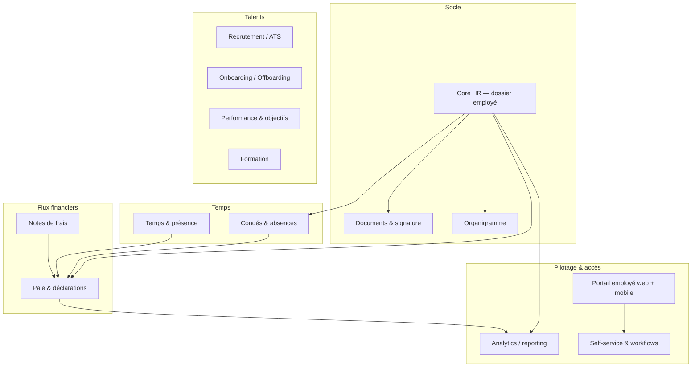

# Vision produit et périmètre fonctionnel

> **⚠️ Arbitrage post-revue** ([09-revue-critique.md](09-revue-critique.md), A1) : la revue croisée a relevé une contradiction entre ce chapitre (« paie dans le MVP ») et la roadmap du ch. 08 (« paie exclue du MVP »). **Arbitrage retenu : le pilote APIX est contractualisé en deux lots** — Lot 1 (Core HR + congés & absences + portail employé + documents), puis Lot 2 (paie sénégalaise) avec date cible et critères d'acceptation signés. La paie reste donc dans le périmètre MVP au sens produit et commercial, mais elle est livrée en second, sur des données Core HR déjà fiabilisées. Ce phasage doit être acté par écrit avec l'APIX dès la semaine 1.

> **Objet du chapitre** : fixer ce que Teranga RH est (et n'est pas), pour qui, avec quels modules, dans quel ordre. Toutes les décisions d'architecture des chapitres suivants découlent de ce périmètre.

## 1. Analyse du marché et positionnement

### 1.1 Ce que font les leaders — et pourquoi ils laissent un espace

| Acteur | Cible | Force principale | Angle mort pour l'UEMOA |
|---|---|---|---|
| **Payfit** | PME France/Espagne (10-500 sal.) | Paie française automatisée + UX excellente ; a prouvé qu'un « moteur de paie local profond + SaaS moderne » est un modèle gagnant | Verrouillé sur ses pays : chaque pays est un investissement réglementaire massif (Payfit s'est même retiré du UK et de l'Allemagne — à vérifier). Aucune raison économique d'adresser le Sénégal avant 10 ans |
| **Rippling** | US, mid-market | Plateforme unifiée RH/IT/Finance, « employee graph » | Anglophone, prix US, aucune paie native hors de ses marchés cœur |
| **Deel** | Global, EOR & contractors | Couverture ~150 pays via partenaires et entités locales | Modèle EOR/contractor à ~500 $+/mois/employé : conçu pour des entreprises étrangères employant en Afrique, pas pour une PME dakaroise qui paie ses propres salariés |
| **BambooHR** | SMB anglophones | Core HR simple et agréable | Pas de paie hors US, pas de français, prix en USD |
| **Workday** | Grands comptes 5 000+ | Profondeur ERP RH | Implémentations 6-18 mois, coût prohibitif, non-sujet ici |
| **Sage Paie & RH** | Afrique francophone (via intégrateurs) | **Le concurrent réel** : présence historique, paie locale correcte | On-premise/legacy, UX datée, dépendance aux intégrateurs, pas de self-service employé digne de ce nom |

Concurrents africains à surveiller : **SeamlessHR** et **PaidHR** (Nigeria), **Workpay** (Kenya) — tous centrés sur l'Afrique anglophone. L'Afrique de l'Ouest **francophone** est le marché le moins servi du continent : le statu quo y est Sage on-premise, le cabinet comptable, ou Excel.

### 1.2 Différenciation défendable

Classée par solidité de la barrière :

1. **Moteur de paie UEMOA natif** (Sénégal d'abord) : IPRES régime général et cadres, CSS (prestations familiales + AT/MP), barème progressif IR + TRIMF, CFCE, convention collective interprofessionnelle. C'est la vraie barrière : 12-24 mois de travail réglementaire par pays, sans aucune valeur pour un acteur global. C'est le fossé de Payfit, transposé.
2. **Souveraineté et conformité locale** : conformité loi n°2008-12 / CDP démontrable + RGPD, argument décisif pour le secteur public et parapublic (l'APIX en tête) et les groupes régionaux.
3. **Mobile money natif** : versement des salaires et acomptes via Wave / Orange Money, là où les concurrents ne connaissent que SEPA/ACH. Différenciant et très visible en démo.
4. **Mobile-first employé, tolérant aux coupures** : consultation du bulletin, demande de congé, acompte — depuis un smartphone d'entrée de gamme en 3G instable.
5. **Prix en FCFA adapté** : hypothèse de travail 1 000-3 000 FCFA/employé/mois selon modules (à valider par entretiens) — inatteignable pour un acteur facturant en USD/EUR.

Ce qui n'est **pas** une différenciation : « un beau design ». L'exigence Stripe/Linear est une condition d'entrée pour l'ambition mondiale, pas un argument de vente au Sénégal.

**Positionnement en une phrase** : *le Payfit de la zone UEMOA — la paie locale exacte des meilleurs cabinets, l'expérience produit des meilleurs SaaS mondiaux, au prix du marché ouest-africain.*

## 2. Personas et jobs-to-be-done

| Persona | Contexte | Jobs-to-be-done principaux |
|---|---|---|
| **DRH / Responsable RH** (acheteur + admin) | PME/ETI ou org. publique, souvent seule sur la fonction | Dossier employé unique et fiable ; prouver la conformité (CDP, inspection du travail) ; sortir les effectifs/contrats en 2 clics ; ne plus courir après les papiers |
| **Gestionnaire de paie** (utilisateur critique) | Interne ou en cabinet ; aujourd'hui sur Sage/Excel | Clôturer la paie du mois sans erreur ni retard ; comprendre chaque ligne du bulletin ; produire les déclarations IPRES/CSS/fiscales ; gérer acomptes, rappels, STC |
| **Manager** | Encadrant 5-30 personnes, peu de temps | Approuver congés/frais en 10 secondes (mobile) ; voir qui est présent/absent ; suivre son équipe sans solliciter les RH |
| **Employé** | Mobile-first, connectivité variable, parfois faible littératie numérique | Voir son bulletin et son solde de congés ; poser un congé ; demander un acompte ; mettre à jour ses infos ; obtenir une attestation de travail sans se déplacer |
| **Dirigeant** | DG/gérant, sponsor budget | Masse salariale et effectifs en temps réel ; risques (contrats expirés, déclarations en retard) ; coût par direction/projet |
| **Expert-comptable multi-clients** *(V2)* | Gère la paie de 10-100 PME | Traiter N dossiers de paie dans une interface unique ; facturer son temps ; canal de distribution clé du produit |

Décision : le MVP sert les 5 premiers personas. L'expert-comptable est un **canal de distribution** majeur pour la V2, pas une cible MVP — son besoin multi-dossiers impose des choix d'architecture (multi-tenant avec rôles trans-tenant) qu'on pose dans les fondations mais qu'on n'expose pas avant.

## 3. Cartographie des modules du produit final

Lecture clé : **tout converge vers la paie**. Le Core HR en est la source de vérité amont ; congés, présence et frais l'alimentent. C'est ce graphe de dépendances qui dicte l'ordre des phases — pas les préférences.

| Module | Contenu cible (produit final) |
|---|---|
| Core HR | Dossier employé complet (état civil, contrats, avenants, rémunération, pièces), historisation à date d'effet, champs personnalisés |
| Paie | Moteur de règles paramétrable par pays, bulletins, acomptes, STC, déclarations sociales/fiscales, virements et mobile money, comptabilisation |
| Congés & absences | Types de congés paramétrables (CCNI : 24 j ouvrables/an + ancienneté — à vérifier), acquisition automatique, workflow d'approbation, calendrier équipe |
| Temps & présence | Pointage (mobile/web/badgeuse), heures sup, plannings, alimentation directe de la paie |
| Recrutement / ATS | Offres, pipeline candidats, page carrière, scorecards |
| Onboarding / Offboarding | Checklists, collecte de pièces avant J1, signature du contrat, révocation des accès |
| Performance | Objectifs, campagnes d'entretiens, feedback |
| Formation | Catalogue, sessions, budget, obligations légales |
| Notes de frais | Capture photo mobile, workflow, remboursement en paie ou mobile money |
| Documents & signature | Coffre-fort par employé, modèles (attestations, contrats), signature électronique |
| Organigramme | Généré depuis le Core HR, zéro saisie |
| Analytics | Tableaux de bord DRH/dirigeant, masse salariale, effectifs, export |
| Portail employé | PWA mobile-first : bulletins, congés, acomptes, infos personnelles |
| Self-service & workflows | Moteur de demandes/approbations transverse à tous les modules |

## 4. Périmètre par phase

### 4.1 Règle de découpage

Le MVP doit rendre l'APIX **capable d'abandonner son outillage actuel pour la paie et les congés**. Tout module qui ne conditionne pas cet objectif sort du MVP. La paie est dedans, et c'est le point le plus tranché de ce chapitre : **un SIRH sans paie serait un BambooHR francophone — sans barrière défendable et sans valeur décisive pour l'APIX**. C'est plus long à construire, mais c'est le produit.

### 4.2 Découpage module par module

| Module | MVP APIX | V1 commercialisable | V2 |
|---|---|---|---|
| Core HR | ✅ Complet (contrats, historisation à date d'effet, import Excel) | Champs personnalisés, alertes (fins de contrat, périodes d'essai) | — |
| Paie Sénégal | ✅ Moteur complet : IPRES RG (plafond ~432 000 FCFA/mois — à vérifier) et cadres, CSS PF + AT/MP, IR progressif + TRIMF, CFCE ; bulletins conformes ; acomptes ; export virements bancaires | STC et rappels automatisés ; **déclarations IPRES/CSS/fiscales générées** ; export comptable paramétrable ; **salaires via Wave / Orange Money** | Multi-pays : Côte d'Ivoire (CNPS, ITS), puis reste UEMOA |
| Congés & absences | ✅ Types CCNI, acquisition auto, workflow simple, impact paie | Calendrier équipe, jours fériés multi-pays, délégation d'approbation | — |
| Portail employé (PWA) | ✅ Bulletins, solde et demande de congés, infos personnelles, français | Demande d'acompte, notifications push, anglais | Wolof (audio/pictos à étudier), mode offline enrichi |
| Documents | ✅ Coffre-fort bulletins + pièces, 3 modèles d'attestations | Générateur de modèles, envoi en masse | Signature électronique qualifiée (prestataire local — à vérifier) |
| Self-service & workflows | ✅ Approbation congés uniquement | Moteur de workflow générique (frais, acomptes, données perso) | Workflows multi-étapes paramétrables |
| Organigramme | — | ✅ Généré automatiquement | — |
| Notes de frais | — | ✅ Capture mobile + remboursement en paie | Cartes / intégrations |
| Onboarding / Offboarding | — | ✅ Checklists + collecte de pièces | Provisioning des accès (SSO/SCIM) |
| Temps & présence | — | Pointage mobile simple (si demande client avérée) | ✅ Plannings, heures sup, badgeuses |
| Analytics | Exports CSV/Excel seulement | ✅ Dashboards standard (masse salariale, effectifs, absentéisme) | Analytics avancé, benchmarks anonymisés |
| Recrutement / ATS | — | — | ✅ |
| Performance & objectifs | — | — | ✅ |
| Formation | — | — | ✅ |
| Portail expert-comptable | — | — | ✅ Multi-dossiers |
| Multi-tenant & facturation | Mono-tenant de fait (APIX), mais **schéma multi-tenant dès le jour 1** | ✅ Inscription self-serve, facturation FCFA, rôles/permissions complets | Marque blanche cabinets |

### 4.3 Effort et jalons (ordres de grandeur, équipe de 2)

| Phase | Contenu | Effort estimé | Calendrier (2 devs) |
|---|---|---|---|
| **MVP APIX** | 5 modules ✅ ci-dessus | 12-16 mois-homme (dont 4-6 pour le seul moteur de paie + validation par un expert paie sénégalais, **budget à prévoir**) | 8-10 mois, dont 2 mois de double-run paie (Teranga RH vs système actuel) avant bascule |
| **V1** | Colonne V1 | +10-14 mois-homme | +6-8 mois ; objectif : 10 clients payants UEMOA |
| **V2** | Colonne V2 | Équipe élargie (4-6 devs) | Financée par les revenus V1 |

Tous les taux, plafonds et règles cités sont **à vérifier systématiquement** contre les textes en vigueur (CGI sénégalais, barèmes IPRES/CSS, CCNI) au moment de l'implémentation — le chapitre « moteur de paie » devra s'appuyer sur une source réglementaire maintenue, pas sur ce document.

## 5. Principes produit non négociables

1. **La paie est le cœur, pas un module.** Fiabilité absolue : chaque ligne de bulletin est traçable à une règle nommée et versionnée, explicable en langage clair à un gestionnaire. Un moteur de paie « boîte noire » est un motif de rejet d'architecture.
2. **Self-service d'abord.** Toute information qu'un employé peut consulter ou modifier lui-même ne transite jamais par les RH. Le volume de tickets RH est une métrique produit à faire baisser.
3. **Zéro saisie double.** Une donnée = une source de vérité. Un congé approuvé impacte le bulletin sans réécriture ; l'organigramme se déduit du Core HR ; toute fonctionnalité exigeant une resaisie est refusée en conception.
4. **Mobile-first employé, desktop-first gestionnaire.** Le portail employé est conçu pour un Android d'entrée de gamme en 3G ; les écrans de gestion de paie assument le grand écran et la densité.
5. **Performance budgétée : p95 < 2 s par écran sur réseau ouest-africain**, < 500 ms pour les interactions courantes. Budget de performance mesuré en CI, pas une intention.
6. **Tolérant aux coupures.** Lecture des données clés (bulletins, soldes) disponible offline dans la PWA ; les actions échouées se mettent en file et se rejouent — jamais de perte de saisie.
7. **Modulaire par tenant.** Chaque module est activable/désactivable par client sans effet de bord ; le prix suit les modules actifs.
8. **Conformité par défaut.** RGPD + loi 2008-12 dès la conception : minimisation, durées de rétention paramétrées, journal d'audit immuable, export/purge par employé. La conformité est une feature vendable, pas une contrainte subie.
9. **Multi-pays, multi-langue, multi-tenant dans les fondations — pas dans l'interface.** Le schéma de données (règles de paie par pays, i18n, tenancy) est prêt dès le MVP ; on ne construit aucun écran multi-pays avant d'avoir un deuxième pays.
10. **Un produit, pas des projets.** Zéro personnalisation spécifique codée en dur pour un client — y compris l'APIX. Tout besoin client devient soit du paramétrage générique, soit un refus. C'est la condition de survie d'une équipe de 2 face à des clients grands comptes.
