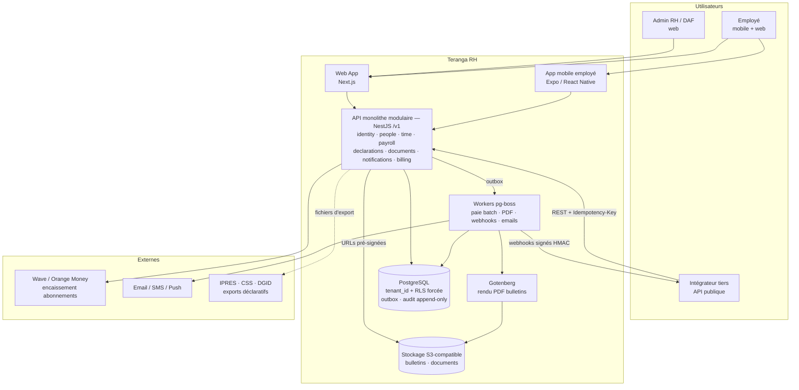

# Architecture technique globale

> **⚠️ Arbitrages post-revue** ([09-revue-critique.md](09-revue-critique.md), A6/A7/A15) : (1) **Expo/React Native sort du socle initial** — la PWA Next.js est l'unique cible mobile jusqu'à la V1+ ; le formatter React Native de Style Dictionary reste « dormant » tant qu'aucune app RN ne démarre réellement. (2) L'outillage « API publique niveau Stripe » (webhooks sortants signés + retries, Idempotency-Key exposée, politique de dépréciation) est documenté en ADR mais implémenté seulement à l'arrivée du premier consommateur externe ; le MVP conserve les conventions quasi gratuites (erreurs RFC 9457, pagination par curseur, OpenAPI généré). (3) Le couple RLS + pooling transactionnel impose : \`SET LOCAL\` dans un middleware unique, rôle applicatif non-owner, propagation du \`tenant_id\` dans chaque job pg-boss, et un test de fuite inter-tenant en CI exécuté contre le pooler réel.

> **Décisions clés de ce chapitre** : monolithe modulaire TypeScript/NestJS · multi-tenant partagé avec RLS Postgres · monorepo TS unique (Next.js web, Expo mobile) · API REST-only niveau Stripe · effective dating + outbox + audit immuable dès le premier commit.

## 1. Style d'architecture : monolithe modulaire, sans hésitation

### 1.1 Décision

**Monolithe modulaire déployé comme un seul processus (API + workers), dans un monorepo.** Les microservices sont écartés — non pas « pour l'instant, on verra », mais avec un critère de sortie explicite : on ne reconsidère la question qu'à partir de ~8 développeurs backend **et** d'un besoin d'isolation avéré (SLA différencié, scaling asymétrique mesuré, équipes autonomes).

| Critère | Monolithe modulaire | Microservices |
|---|---|---|
| Vélocité à 1-2 devs | Maximale (un déploiement, une base, un debugger) | Catastrophique (réseau, contrats, observabilité distribuée) |
| Transactions paie (cohérence forte requise) | ACID natif Postgres | Sagas, compensation, complexité injustifiable |
| Coût infra MVP | ~100-200 €/mois | ×5 à ×10 minimum |
| Risque principal | Devenir un « big ball of mud » | Mauvais découpage figé dans le réseau |
| Chemin vers l'excellence | Discipline de frontières internes | Prématuré = dette, pas excellence |

Le risque du monolithe (couplage rampant) se traite par de l'outillage, pas par du réseau : les frontières de modules sont **vérifiées en CI** (ESLint `boundaries` ou contraintes de projets Nx/Turborepo — imports inter-modules interdits hors interface publique).

### 1.2 Frontières de modules (bounded contexts)

Huit contextes, choisis pour correspondre aux lignes de fracture naturelles du domaine RH/paie — c'est-à-dire les endroits où une extraction en service serait un jour plausible :

| Module | Responsabilité | Pourquoi c'est une frontière |
|---|---|---|
| `identity` | Tenants, utilisateurs, authN/authZ, RBAC, invitations | Transverse, candidat n°1 à mutualisation multi-produits (APIX) |
| `people` | Dossier employé, contrats, rémunérations, organigramme — **cœur effective-dated** | Source de vérité consommée par tous les autres |
| `time` | Absences, congés, jours fériés Sénégal, feuilles de temps | Volumétrie et rythme propres (saisie quotidienne mobile) |
| `payroll` | Moteur de calcul (IPRES, CSS, IR/TRIMF, CFCE — taux **à vérifier** à chaque exercice), cycles de paie, éléments variables | L'actif stratégique ; isolé en **cœur pur sans I/O** (§5.3) |
| `declarations` | Exports IPRES/CSS/DGID, télédéclarations futures | Couplé aux formats administratifs, pas au reste |
| `documents` | GED, stockage S3, génération PDF, modèles | Candidat naturel à extraction (charge CPU des rendus) |
| `notifications` | Email, SMS, push Expo, in-app, préférences | Purement réactif aux événements de domaine |
| `billing` | Abonnement SaaS, facturation Teranga, mobile money | Ne partage rien avec la paie des clients |

**Règles de couplage** : un module expose une interface publique (services typés) et des **événements de domaine** ; il ne lit jamais les tables d'un autre module. Les workflows inter-modules passent par les événements via l'outbox (§5.1) — ex. `payroll_run.completed` déclenche `documents` (bulletins PDF) puis `notifications` (email employés). Résultat : extraire `documents` en service un jour = remplacer un bus in-process par un bus réseau, sans réécriture.

### 1.3 Alternatives écartées

- **Microservices d'emblée** : voir tableau. À 1-2 devs, c'est le moyen le plus sûr de ne jamais livrer.
- **Monolithe « libre » sans frontières** : vélocité identique au début, mur à 18 mois. Le surcoût de la discipline modulaire est de ~5 % ; c'est l'assurance-vie du projet.
- **Serverless/functions (Lambda)** : cold starts, transactions longues de paie mal adaptées, lock-in, debugging pénible. Écarté.

## 2. Multi-tenancy : schéma partagé + RLS Postgres

### 2.1 Comparaison

| Critère | **Schéma partagé + `tenant_id` + RLS** | Schéma-par-tenant | Base-par-tenant |
|---|---|---|---|
| Migrations à 500 tenants | 1 migration | 500 migrations (dérive quasi certaine) | 500 migrations + 500 connexions |
| Coût infra | 1 instance Postgres | 1 instance, catalogue obèse (vacuum, backups lents) | Prohibitif avant la série A |
| Isolation | Logique, forte si RLS bien faite | Moyenne+ | Maximale |
| Requêtes cross-tenant (analytics produit, admin) | Triviales | Pénibles (UNION de schémas) | Très pénibles |
| Onboarding d'un tenant | 1 INSERT | CREATE SCHEMA + migration | Provisioning complet |
| Adapté à des PME UEMOA de 10-500 employés | Oui | Sur-dimensionné | Non |

**Décision : schéma partagé, `tenant_id UUID NOT NULL` sur toutes les tables métier, Row-Level Security Postgres activée ET forcée (`FORCE ROW LEVEL SECURITY`).**

### 2.2 Implémentation non négociable

- L'application se connecte avec un rôle **non-propriétaire** des tables (la RLS ne s'applique pas au propriétaire — piège classique).
- Chaque requête s'exécute dans une transaction ouverte par un middleware qui pose `SET LOCAL app.tenant_id = '<uuid>'` ; les policies sont `USING (tenant_id = current_setting('app.tenant_id')::uuid)`. Compatible PgBouncer en pooling transactionnel.
- Défense en profondeur : le filtre `tenant_id` est **aussi** posé côté ORM (wrapper de requête). La RLS est le filet, pas l'unique barrière.
- Index composites `(tenant_id, ...)` systématiques ; test d'intégration dédié qui tente des fuites cross-tenant sur chaque table (généré automatiquement depuis le schéma).

### 2.3 Évolution : gros clients « dedicated »

Le jour où un ministère ou un groupe exige une base dédiée (argument commercial réel en secteur public) : **réplication logique Postgres filtrée par `tenant_id`** (publication/subscription) vers une instance dédiée, bascule du routage par un `tenant → connection string` résolu à l'entrée de la requête, puis purge de l'ancienne base. Le code ne change pas : il est déjà écrit contre « une base dont je reçois la connexion ». Ce routage par tenant est prévu dès le jour 1 (une indirection de 30 lignes), son exploitation multi-bases est reportée. Même mécanisme pour une éventuelle exigence de résidence des données (instance à Dakar vs UE).

Écarté : Citus/sharding (inutile avant plusieurs millions de bulletins/mois), « pool de bases » façon Rails multi-DB (complexité opérationnelle sans bénéfice à notre taille).

## 3. Stack technique

### 3.1 Backend : TypeScript + NestJS

| Option | Productivité CRUD | Typage bout-en-bout | Écosystème paie/PDF/jobs | Recrutement Dakar/UEMOA | Verdict |
|---|---|---|---|---|---|
| **TS + NestJS** | Bonne | **Oui, unique atout décisif** | Très bon (npm) | Excellent (JS omniprésent) | **Retenu** |
| Ruby on Rails | Excellente | Non (2 langages avec le front/mobile) | Très bon | Faible localement | Écarté |
| PHP Laravel | Excellente | Non | Très bon | Bon localement | Écarté de peu |
| Go | Moyenne (CRUD verbeux) | Non | Moyen | Faible | Écarté |
| Elixir/Phoenix | Bonne | Non | Moyen | Quasi nul localement | Écarté |

Le facteur qui tranche n'est pas le framework, c'est **un seul langage pour l'API, le web, le mobile et les contrats partagés**. Le fondateur maîtrise déjà React/Expo : Rails ou Laravel — pourtant plus productifs nus — imposeraient de maintenir deux mondes, deux systèmes de types, une duplication des règles de validation. À deux développeurs, ce coût domine tout le reste. NestJS plutôt que Fastify/Hono nus : ses conventions (modules, DI, guards, interceptors) fournissent gratuitement la discipline modulaire du §1 ; son style « enterprise » est un plus pour la crédibilité du code face à des audits. Go et Elixir offrent des runtimes supérieurs dont nous n'avons pas besoin : la paie est du batch, pas du temps réel massif.

### 3.2 Monorepo et frontend

**Monorepo pnpm workspaces + Turborepo** :

```
apps/api        (NestJS)          packages/contracts   (Zod + OpenAPI, partagé partout)
apps/web        (Next.js)         packages/payroll-engine (pur, zéro dépendance I/O)
apps/mobile     (Expo)            packages/ui          (design system web, shadcn/ui + Tailwind)
apps/site       (Next.js, vitrine)packages/config      (eslint, tsconfig, tokens design)
```

- **Web : Next.js (App Router)** + TanStack Query + shadcn/ui + Tailwind. Alternatives écartées : SPA Vite + TanStack Router (viable, mais Next apporte le site vitrine SEO, le rendu serveur des pages publiques et un écosystème de recrutement plus large pour un gain de simplicité marginal) ; Remix (pari plus risqué, moindre bassin d'embauche). L'exigence « niveau Stripe/Linear » se joue dans le design system maison sur primitives Radix/shadcn — pas dans le framework.
- **Mobile : Expo/React Native** — l'atout existant du fondateur, exploité à fond. App **employé** self-service (bulletins, congés, pointage), mobile-first, avec cache local (TanStack Query + persistance) pour la connectivité instable ; OTA updates via EAS Update, critique quand les stores et les mises à jour utilisateurs sont lents. L'app RH admin reste web-only en v1.
- Les schémas Zod de `packages/contracts` valident côté API **et** côté formulaires web/mobile : une seule définition de « salaire de base valide ».

### 3.3 Briques techniques

| Besoin | **Retenu** | Écarté | Justification |
|---|---|---|---|
| ORM | **Drizzle** | Prisma, TypeORM, Kysely nu | SQL-first : indispensable pour RLS (`SET LOCAL`), CTE, contraintes d'exclusion, requêtes temporelles. Prisma abstrait trop et gère mal les variables de session ; TypeORM vieillissant ; Kysely excellent mais Drizzle ajoute le schéma déclaratif + migrations |
| Validation | **Zod** | class-validator, Joi | Partagé front/mobile/back, inférence de types, génération OpenAPI (`zod-openapi`) |
| Jobs/files | **pg-boss** (sur Postgres) | BullMQ+Redis, SQS | **Enfilement transactionnel** dans la même transaction que le métier (cf. outbox §5.1), une brique d'infra en moins. La paie = batch de milliers de jobs/mois, pas millions/seconde. BullMQ si un jour le débit l'exige — interface job isolée pour permettre le swap |
| Cache | **Aucun au MVP**, puis Redis managé | Redis dès J1 | À 200-500 employés/tenant, Postgres indexé répond en <10 ms. Redis entre avec le rate limiting de l'API publique (~15 €/mois managé) |
| Temps réel | **SSE** (+ invalidation TanStack Query) | WebSockets, Pusher | Besoins réels : notifications, progression d'un run de paie. Unidirectionnel → SSE suffit, traverse les proxies, se reconnecte seul. Pas d'édition collaborative au programme |
| Recherche | **Postgres FTS + `pg_trgm` + `unaccent`** | Meilisearch, Typesense, Elastic | Chercher parmi ≤ quelques milliers d'employés/tenant : Postgres excelle. Meilisearch réévalué si recherche globale multi-entités avec facettes devient un différenciateur |
| Auth | Sessions serveur + OIDC-ready (détail au chapitre sécurité) | — | Le SSO (Azure AD/Google) est un prérequis enterprise, prévu dans le modèle dès le départ |

**Coût infra MVP estimé** : Postgres managé (~30-60 €), 2 instances applicatives (~30-60 €), stockage S3-compatible (~5-20 €), email/SMS à l'usage → **~100-200 €/mois** hors noms de domaine et outillage.

## 4. Architecture API

### 4.1 REST-only, une seule API

**Décision : une API REST unique, spécifiée OpenAPI 3.1 (générée depuis les schémas Zod), consommée par le web, le mobile ET les intégrateurs publics.** Principe Stripe : on mange sa propre API publique ; c'est ce qui garantit qu'elle est complète et soignée.

- **GraphQL écarté** : surface d'autorisation explosive (dangereux en RH — qui voit quel salaire ?), caching HTTP perdu, complexité N+1, coût d'apprentissage pour les intégrateurs UEMOA. Aucun besoin de requêtage libre par des clients inconnus.
- **tRPC écarté** pour l'API cœur : magnifique en interne, inutilisable par des tiers → il faudrait maintenir REST *en plus*. Deux surfaces d'API pour 2 devs = non. Le typage bout-en-bout est obtenu autrement : client TS généré depuis l'OpenAPI (`openapi-typescript` + fetcher typé dans `packages/contracts`).

### 4.2 Versioning

`/v1` dans l'URL, **changements additifs uniquement** à l'intérieur d'une version (nouveau champ = jamais cassant ; les clients doivent tolérer les champs inconnus — documenté). Breaking change → `/v2` avec période de cohabitation et **politique de dépréciation publiée : 12 mois minimum**, en-têtes `Deprecation`/`Sunset`. Le versioning par date façon Stripe (`Stripe-Version: 2026-08-17`) est écarté : sa machinerie de couches de compatibilité exige une équipe plateforme dédiée — over-engineering caractérisé à notre taille.

### 4.3 Standards « niveau Stripe » dès le v1

| Standard | Implémentation |
|---|---|
| **Idempotence** | En-tête `Idempotency-Key` (UUID) sur tous les POST mutateurs. Stockage `(tenant, endpoint, clé, hash requête, réponse)` 24 h ; rejeu → réponse originale ; même clé + corps différent → `409` |
| **Pagination** | Curseur opaque (base64 de `(tri, id)`), `limit` max 100, réponse `{ data, has_more, next_cursor }`. Offset écarté (dérive sous écriture concurrente, perf) |
| **Erreurs** | RFC 9457 `application/problem+json` + champ `code` machine-readable stable (`payroll_run_locked`, `tenant_quota_exceeded`…) + `request_id` corrélé aux logs |
| **Webhooks sortants** | Événements nommés `domaine.action` (`employee.created`, `payroll_run.completed`), signature HMAC-SHA256 `X-Teranga-Signature: t=<ts>,v1=<hmac>` (anti-rejeu 5 min), retries backoff exponentiel 72 h, endpoint de re-livraison manuelle, secrets rotables par endpoint |
| **Rate limiting** | Par tenant + par clé API, en-têtes `RateLimit-*`, `429` avec `Retry-After` (activé avec l'ouverture publique) |
| **Clés API** | Préfixées façon Stripe (`trh_live_…`, `trh_test_…`), hashées en base, scopes par module |

Les webhooks sortants réutilisent l'outbox interne (§5.1) : un événement de domaine = zéro ou N livraisons webhook. Un seul mécanisme, deux usages.

## 5. Patterns transverses (fondations non négociables)

### 5.1 Événementiel interne : outbox pattern

Toute mutation significative écrit, **dans la même transaction Postgres**, une ligne dans `outbox_events (id, tenant_id, type, payload jsonb, occurred_at)`. Un relais pg-boss consomme et dispatch vers les handlers internes (notifications, PDF, webhooks). Garantie : jamais d'événement fantôme (transaction annulée) ni d'événement perdu (crash après commit). Kafka/RabbitMQ écartés — Postgres tient ce rôle jusqu'à des volumes que nous n'atteindrons pas avant des années ; le contrat `publish(event)` est une interface, le transport est substituable.

### 5.2 Audit log immuable

Table `audit_log` **append-only** : `(id, tenant_id, actor_id, actor_type, action, resource, resource_id, before jsonb, after jsonb, ip, request_id, at)`. Immutabilité par les privilèges : le rôle applicatif n'a que `INSERT` et `SELECT` — pas de `UPDATE`/`DELETE` possibles, même en cas de bug. Partitionnée par mois, purge selon la politique de rétention (durées légales sénégalaises **à vérifier** avec le juriste ; bulletins et livres de paie : conservation longue, ordre de 10 ans **à vérifier**). Distincte des données métier et exposée dans le produit (page « Activité » par tenant) : exigence CDP/RGPD *et* argument de vente enterprise. Le chaînage cryptographique (hash chain) est noté comme évolution possible, pas fait en v1.

### 5.3 Effective dating — le pattern le plus important du domaine

Une donnée RH n'a pas une valeur, elle a une **histoire de valeurs** : salaire, poste, taux de contribution, situation familiale (pour l'IR). Sans cela, impossible de recalculer une paie de mars en juillet, de gérer une augmentation rétroactive ou un contrôle IPRES.

- Entités versionnées (`contract_versions`, `compensation_versions`, `assignment_versions`…) : `valid_from date`, `valid_to date NULL` + contrainte d'exclusion GiST anti-chevauchement (`EXCLUDE USING gist (employee_id WITH =, daterange(valid_from, valid_to) WITH &&)`), invariant garanti par la base elle-même.
- **Les barèmes légaux sont eux-mêmes effective-dated** : le barème IR, les plafonds IPRES, les taux CSS (valeurs **à vérifier**) sont des données datées et versionnées, jamais des constantes dans le code. Changement de loi de finances = INSERT, pas déploiement.
- On s'arrête au *valid time* + audit log (qui fournit le *transaction time* a posteriori). Le **bitemporel complet** (Workday-style) est écarté en v1 : coût cognitif élevé, bénéfice marginal à notre taille — mais le modèle versionné rend l'ajout possible sans refonte.

### 5.4 Moteur de paie : cœur fonctionnel pur

`packages/payroll-engine` : fonctions pures `(snapshot employé effective-daté, éléments variables, barèmes datés) → bulletin calculé`, zéro I/O, zéro date système implicite. Conséquences : testable par snapshots et property-based testing (masse salariale = somme des nets + retenues, jamais de net négatif…), **rejouable à l'identique** des années après (chaque run de paie fige `engine_version` + `rule_set_version`), et auditable ligne à ligne. C'est le composant qui justifiera la confiance — il reçoit le plus haut standard de test du projet.

### 5.5 Soft delete — avec lucidité RGPD

`deleted_at timestamptz NULL` sur les entités métier (un employé « supprimé » reste indispensable aux paies passées), exclusion par défaut dans les requêtes (vue ou filtre ORM systématique). **Mais** le droit à l'effacement (RGPD art. 17, loi 2008-12) exige plus : job d'**anonymisation** dédié (écrasement des champs identifiants, conservation des agrégats comptables légalement requis — périmètre exact **à vérifier** avec le juriste). Le soft delete est un outil produit, pas une réponse de conformité.

### 5.6 Idempotence des jobs

Tout job est rejouable sans dégât : clé métier unique (`payroll_run:{id}:generate_payslips`), upserts plutôt qu'inserts, et vérification d'état avant effet de bord externe (email, webhook). pg-boss fournit déduplication par clé et retries ; la discipline « un job peut s'exécuter deux fois » est une règle de code review, vérifiée pour tout effet externe.

### 5.7 Fichiers et documents

Stockage **S3-compatible** (choix du fournisseur au chapitre hébergement — critères : coût, latence depuis Dakar, résidence des données). Upload direct par URL pré-signée (le fichier ne transite pas par l'API), clés préfixées `tenant_id/`, bucket privé, chiffrement au repos, antivirus (ClamAV en job) sur les uploads employés. Table `documents` (métadonnées, propriétaire, rétention) dans le module `documents`.

### 5.8 Génération PDF (bulletins)

**Décision : templates HTML/CSS rendus par Chromium headless via Gotenberg** (conteneur dédié, API HTTP, isole la charge CPU du process API). Le bulletin partage le design system du produit ; itération instantanée par les 2 devs qui savent déjà faire du HTML/CSS. Écartés : `react-pdf`/pdfkit (mise en page programmatique pénible pour un document légal dense), wkhtmltopdf (abandonné), Typst (rapide et élégant mais compétence supplémentaire à acquérir — réévalué si le rendu Chromium devient un goulot, seuil ~10 000 bulletins/run). Bulletins générés en batch par jobs idempotents, stockés en S3, hash SHA-256 enregistré pour l'intégrité ; export PDF/A pour l'archivage étudié en phase 2.

## 6. Vue d'ensemble (C4 simplifié : contexte + conteneurs)



Déploiement v1 : **API et workers = même image, deux modes de démarrage** ; Gotenberg en conteneur sidecar ; Postgres et S3 managés. Deux processus applicatifs à surveiller, pas vingt.

## 7. Ce qu'on ne construit PAS (et pourquoi c'est une décision d'architecture)

| Refusé en v1 | Déclencheur de réévaluation |
|---|---|
| Microservices | ≥ 8 devs backend + besoin d'isolation mesuré |
| Kafka / RabbitMQ | Outbox Postgres saturé (> ~1 000 événements/s soutenus) |
| GraphQL | Jamais, sauf pivot produit majeur |
| Kubernetes | > ~10 services ou équipe ops dédiée |
| CQRS / event sourcing généralisé | Jamais généralisé ; localement si un module le justifie |
| Moteur de recherche dédié | Recherche à facettes multi-entités devenue différenciateur |
| Data warehouse | Besoins analytics dépassant les réplicas de lecture Postgres |
| Bitemporalité complète | Exigence d'audit client de type Workday |

Chaque ligne de ce tableau est une heure d'exploitation et un point de complexité rendus à la seule chose qui compte à ce stade : livrer une paie sénégalaise juste, auditable et agréable à utiliser — sur des fondations qui n'auront pas à être renversées quand l'ambition mondiale deviendra réalité.
