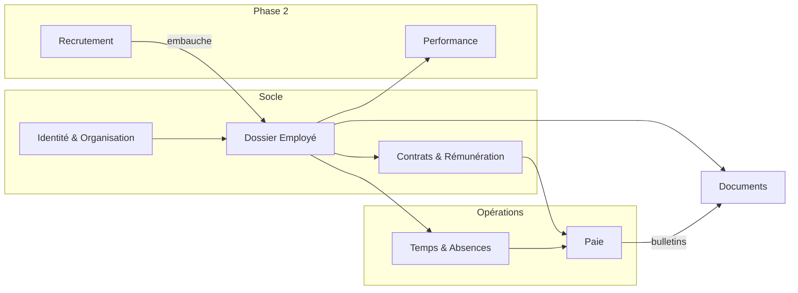
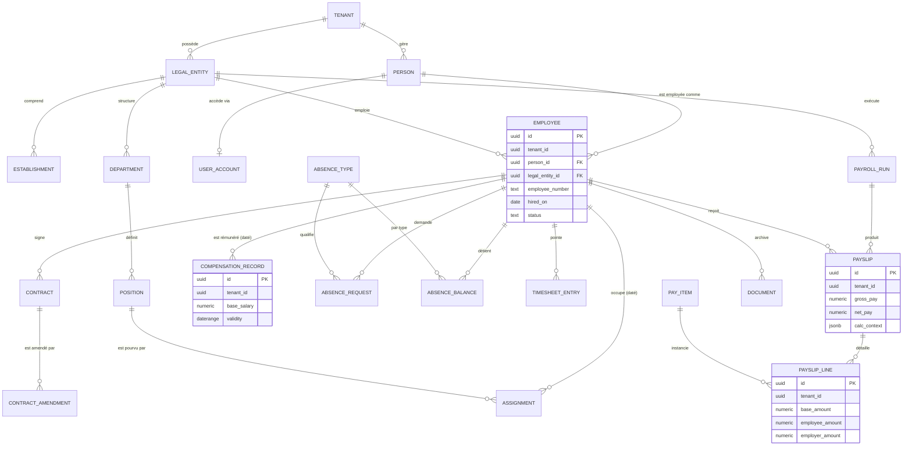

# Modèle de données et domaines (DDD)

> **Décisions clés de ce chapitre** : monolithe modulaire sur une seule base PostgreSQL ; séparation stricte `Person` / `User` / `Employee` ; effective dating par tables versionnées `daterange` (pas d'event sourcing) ; RLS PostgreSQL en défense en profondeur ; paie immuable à rubriques paramétrées ; chiffrement applicatif ciblé (IBAN, mobile money, CNI — pas les salaires).

## 1. Principes directeurs

Trois principes non négociables gouvernent le modèle :

1. **Un SI RH est une machine à remonter le temps.** Toute question métier est datée : « quel était son salaire au 1er mars ? », « qui était son manager au moment de l'évaluation ? », « quel taux IPRES appliquer pour la paie de janvier recalculée en avril ? ». L'effective dating (§4) n'est pas une option, c'est LA fondation. Les produits qui l'ont bolt-on après coup (beaucoup de SIRH de première génération) ne s'en remettent jamais.
2. **La paie est un système comptable.** Immuabilité, traçabilité, corrections par écritures compensatoires — jamais par écrasement.
3. **Le multi-pays est une donnée, pas du code.** Taux, plafonds, barèmes et rubriques sont des enregistrements paramétrés et datés. Le moteur de paie sénégalais de la V1 doit être une *instanciation* d'un moteur générique, pas un fork à réécrire pour la Côte d'Ivoire.

**Décision d'architecture** : monolithe modulaire, **une seule base PostgreSQL** (≥ 17, cible 18), un schéma logique par context. Chaque context possède ses tables en écriture exclusive ; les autres modules lisent via des interfaces de code (pas d'accès SQL direct cross-module), mais **on conserve les FK physiques entre contexts** — l'intégrité référentielle vaut plus que la pureté DDD à ce stade. Microservices et base-par-context : écartés, coût opérationnel indéfendable à 1-2 développeurs, et une paie a besoin de transactions ACID couvrant plusieurs contexts. À 500 employés × 12 paies × ~60 rubriques ≈ **360 000 lignes de paie/an** : PostgreSQL n'a même pas chaud à 100 fois ce volume.

## 2. Bounded contexts



| Context | Responsabilité | Entités principales | Relations |
|---|---|---|---|
| **Identité & Organisation** | Tenants, entités légales (NINEA, n° employeur IPRES/CSS), établissements, départements, postes ; référentiel organisationnel daté | Tenant, LegalEntity, Establishment, Department, Position | Amont de tout ; ne dépend de personne |
| **Dossier Employé** (core HR) | Identité civile, dossiers d'emploi, affectations, contacts, personnes à charge (quotient familial) | Person, User, Employee, Assignment, Dependent | Consomme Organisation ; source de vérité pour tous les autres |
| **Contrats & Rémunération** | Contrats, avenants, historique de rémunération, classification conventionnelle (catégories CCNI) | Contract, ContractAmendment, CompensationRecord | Lit Dossier Employé ; exposé à la Paie en lecture datée |
| **Temps & Absences** | Types d'absence, règles d'acquisition, demandes/validations, soldes, pointages | AbsenceType, AbsenceRequest, AbsenceBalance, TimesheetEntry | Lit Dossier Employé ; fournit les éléments variables à la Paie |
| **Paie** | Runs de paie, bulletins, rubriques, paramètres légaux datés (IPRES, CSS, barème IR, TRIMF, CFCE — *taux à vérifier au moment du paramétrage*), déclarations | PayrollRun, Payslip, PayslipLine, PayItem, StatutoryRate | Consomme Contrats, Temps, Organisation à une date de référence ; n'est lu par personne en écriture |
| **Recrutement** (phase 2) | Offres, candidats, pipeline ; à l'embauche, promotion Candidate → Person + Employee | JobOpening, Candidate, Application | Isolé ; un seul point de contact : l'embauche |
| **Performance** (phase 2) | Campagnes d'évaluation, objectifs, feedback | ReviewCycle, Review, Goal | Lit Dossier Employé (snapshot manager à date) |
| **Documents** | GED RH : stockage, versions, signatures, rétention légale | Document, DocumentVersion | Transverse ; référencé par Employé, Contrats, Paie |

Recrutement et Performance sont **désignés mais non construits en V1** : on réserve leur place dans le modèle (pas de collision de noms, point d'entrée d'embauche identifié) sans écrire une ligne.

## 3. Entités structurantes

### 3.1 Person / User / Employee — la séparation fondatrice

L'erreur classique des SIRH amateurs est une table `employees` fourre-tout avec un mot de passe dedans. On sépare :

| Entité | C'est quoi | Cardinalités |
|---|---|---|
| **Person** | Une personne physique : état civil, PII (CNI, passeport, NIN), coordonnées personnelles. Existe indépendamment de tout emploi. | 1 Person → 0..n Employee, 0..1 User |
| **User** | Un compte d'authentification (email, MFA, rôles). Un expert-comptable externe ou un admin APIX peut être User sans être Employee ; un ouvrier sans email peut être Employee sans User. | Rattaché à 1 Person, scoppé au tenant |
| **Employee** | Un **dossier d'emploi** : la relation entre une Person et une **LegalEntity** (matricule, date d'entrée, statut). Une personne employée par deux entités du même groupe = deux Employee. Une réembauche = un nouvel Employee (ou réactivation, au choix du tenant — nous recommandons un nouveau dossier, l'historique reste propre). | unique(tenant_id, legal_entity_id, employee_number) |

Conséquence immédiate : le portail self-service mobile (mobile-first, connectivité instable) s'adresse à un User qui *voit* un ou plusieurs dossiers Employee — le multi-entités est gratuit dès le premier jour.

### 3.2 Tenant, LegalEntity, Position, Assignment

- **Tenant** : l'organisation cliente (APIX). Racine d'isolation absolue (§5). Porte les réglages globaux (langue, fuseau — `Africa/Dakar`, devise de référence XOF).
- **LegalEntity** : l'employeur juridique — NINEA, RCCM, n° employeur IPRES et CSS, convention collective applicable (CCNI par défaut au Sénégal), adresse fiscale. C'est l'axe de la paie et des déclarations : un PayrollRun appartient à une LegalEntity, jamais au tenant.
- **Establishment** : lieu physique rattaché à une LegalEntity (des déclarations et la médecine du travail peuvent en dépendre).
- **Position** : un poste dans l'organigramme (intitulé, département, catégorie CCNI, rattachement hiérarchique). Le poste existe indépendamment de son titulaire (poste vacant = Position sans Assignment actif).
- **Assignment** : l'occupation **datée** d'une Position par un Employee (taux d'occupation, manager effectif). C'est une table effective-dated : le changement de poste au 1er juin est une nouvelle ligne, pas un UPDATE.

### 3.3 Contract et avenants

`Contract` porte les termes initiaux (type — CDI, CDD, stage, convention selon droit sénégalais —, date d'effet, période d'essai, date de fin pour un CDD). Chaque **avenant** est un `ContractAmendment` daté qui modifie un sous-ensemble de termes. L'état contractuel courant est une **projection** : contrat initial + avenants applicables à la date demandée. On n'écrase jamais un terme contractuel — c'est à la fois une exigence juridique (l'avenant EST un document opposable) et le pattern d'effective dating appliqué au domaine.

### 3.4 CompensationRecord

L'historique de rémunération est une table effective-dated pure : salaire de base, devise (XOF), fréquence, motif (`hire`, `promotion`, `annual_review`, `collective_increase`), et primes contractuelles fixes en lignes associées. Le moteur de paie lit « la rémunération valide au dernier jour de la période de paie » — jamais « le salaire actuel ».

### 3.5 Temps & Absences

- **AbsenceType** : paramétré **par tenant** avec un socle légal par pays (congés payés sénégalais, maternité, permissions exceptionnelles CCNI — *durées à vérifier lors du paramétrage juridique*) : unité (jour/demi-journée), payé ou non, règle d'acquisition, report autorisé.
- **AbsenceRequest** : machine à états stricte `draft → submitted → approved | rejected → cancelled`, avec validateur = manager résolu via l'Assignment **à la date de la demande**.
- **AbsenceBalance** : solde matérialisé par (employee, absence_type, période d'acquisition) — recalculable depuis les mouvements (accruals + requests), mais matérialisé pour l'affichage mobile instantané. Le recalcul est la source de vérité, le solde est un cache assumé.
- **TimesheetEntry** : pointage/saisie par jour et par employé (heures normales, heures supplémentaires typées — les majorations sénégalaises sont des PayItems, pas des colonnes).

### 3.6 Paie : PayrollRun / Payslip / PayslipLine

- **PayrollRun** : une exécution de paie pour (LegalEntity, période). États : `draft → calculating → review → approved → closed`. **Un run `closed` est immuable** ; toute erreur découverte ensuite se corrige par un run de régularisation qui référence l'original.
- **Payslip** : le bulletin d'un Employee dans un run — fige brut, cotisations salariales/patronales, net imposable, net à payer, **et le contexte de calcul** (snapshot JSONB des paramètres et taux utilisés) pour pouvoir justifier un bulletin de 2026 en 2031 même si les taux ont changé depuis.
- **PayslipLine** : une ligne = une rubrique (`PayItem` : salaire de base, sursalaire, prime d'ancienneté CCNI, IPRES RG/RC, CSS, IR, TRIMF, CFCE…) × (base, taux, montant salarial, montant patronal). Les rubriques sont **des données versionnées par pays**, avec formule paramétrée — c'est ce qui rend le moteur portable en UEMOA.
- **StatutoryRate** : taux et plafonds légaux effective-dated (ex. plafonds IPRES, barème progressif IR — **tous les taux marqués « à vérifier » et validés avec un fiscaliste sénégalais avant paramétrage**).

## 4. Effective dating : le pattern retenu

**Recommandation ferme : tables versionnées avec période de validité `daterange` et contrainte d'exclusion GiST**, appliquées chirurgicalement aux entités à effet temporel : `Assignment`, `CompensationRecord`, `ContractAmendment` (par nature), `StatutoryRate`, `PayItem`, rattachement hiérarchique. Les entités sans sémantique temporelle (une AbsenceRequest, un Document) restent de simples lignes horodatées.

```sql
CREATE EXTENSION IF NOT EXISTS btree_gist;

CREATE TABLE compensation_record (
  id           uuid PRIMARY KEY DEFAULT uuidv7(),   -- natif PG 18
  tenant_id    uuid NOT NULL REFERENCES tenant(id),
  employee_id  uuid NOT NULL REFERENCES employee(id),
  base_salary  numeric(14,2) NOT NULL,
  currency     char(3) NOT NULL DEFAULT 'XOF',
  reason       text NOT NULL,
  validity     daterange NOT NULL,                  -- [valid_from, valid_to)
  created_at   timestamptz NOT NULL DEFAULT now(),
  created_by   uuid NOT NULL,
  EXCLUDE USING gist (tenant_id WITH =, employee_id WITH =, validity WITH &&)
);
```

La contrainte d'exclusion garantit **en base** qu'il n'existe jamais deux salaires qui se chevauchent — aucune discipline applicative requise. Requête « as of » :

```sql
SELECT * FROM compensation_record
WHERE tenant_id = :tid AND employee_id = :eid AND validity @> :as_of_date;
```

Impact sur les requêtes : toute jointure vers une table datée porte la clause `validity @> :date` ; on l'encapsule une fois pour toutes dans le repository (helpers `asOf(date)`) et des vues `*_current` (`validity @> CURRENT_DATE`) pour les écrans « état actuel ». Coût de mise en place du socle (helpers, vues, conventions, tests) : **~2 semaines** — remboursées dès la première rétro-paie.

**Alternatives écartées :**

| Option | Verdict | Pourquoi |
|---|---|---|
| **Event sourcing complet** | Écarté | Le bon modèle *en théorie* pour la paie, mais projections, replay, versioning d'événements et outillage = charge d'une équipe dédiée. À 1-2 devs, c'est le projet qui meurt. On garde l'esprit via l'audit trail (§6) et les snapshots de Payslip. |
| **SCD2 généralisé sur toutes les tables** | Écarté | Versionner l'adresse email ou un libellé de département pollue le modèle. L'audit trail couvre le « qui a changé quoi » ; l'effective dating est réservé aux attributs à effet **métier** dans le temps. |
| **Colonnes `valid_from`/`valid_to` séparées sans daterange** | Écarté | Pas de contrainte d'exclusion native → chevauchements garantis en production. Le `daterange` est fait pour ça. |
| **Extension `temporal_tables` / triggers d'historisation** | Écarté | Historise le *passé technique* (versions de lignes), pas le *futur métier* (augmentation effective au 1er mars saisie en janvier). Un SIRH a besoin des deux sens du temps ; seul l'effective dating explicite donne le second. |

## 5. Multi-tenant au niveau données

Choix (cohérent avec le chapitre infrastructure) : **pool partagé, une base, RLS PostgreSQL en défense en profondeur**. Règles absolues :

1. `tenant_id uuid NOT NULL` sur **toutes** les tables métier, y compris les tables enfants (PayslipLine porte tenant_id même si Payslip l'a déjà) : la RLS et les index ne doivent jamais dépendre d'une jointure.
2. RLS activée et **forcée** (même le propriétaire de table passe par la policy) ; le rôle applicatif n'est jamais superuser :

```sql
ALTER TABLE employee ENABLE ROW LEVEL SECURITY;
ALTER TABLE employee FORCE ROW LEVEL SECURITY;

CREATE POLICY tenant_isolation ON employee
  USING (tenant_id = current_setting('app.tenant_id')::uuid)
  WITH CHECK (tenant_id = current_setting('app.tenant_id')::uuid);
```

Le middleware applicatif exécute `SET LOCAL app.tenant_id = '<uuid>'` en début de chaque transaction (compatible PgBouncer en mode transaction). Une requête sans contexte tenant ne retourne **rien** — un bug applicatif devient une absence de données, pas une fuite inter-clients. Pour un SaaS RH visant des organisations publiques, c'est un argument commercial autant que technique.

3. **Tous** les index secondaires sont préfixés : `(tenant_id, employee_id, …)`, `(tenant_id, status)`. La RLS filtre sur tenant_id dans chaque requête ; sans ce préfixe, l'optimiseur scanne large.
4. **Unicité scoppée au tenant, jamais globale** (sauf identifiants techniques) : `UNIQUE (tenant_id, legal_entity_id, employee_number)`, `UNIQUE (tenant_id, email)` sur User. Deux tenants peuvent avoir un matricule « 00042 ».
5. Migration future vers l'isolation physique d'un gros client (base dédiée) : possible sans refonte puisque tenant_id est partout — on exporte un tenant, on rejoue.

## 6. Audit trail et données sensibles

### 6.1 Audit append-only

Table unique, partitionnée par mois, alimentée par triggers sur les tables métier avec le contexte applicatif injecté par la même mécanique que la RLS (`app.user_id`, `app.request_id`) :

```sql
CREATE TABLE audit_log (
  id            uuid NOT NULL DEFAULT uuidv7(),
  tenant_id     uuid NOT NULL,
  occurred_at   timestamptz NOT NULL DEFAULT now(),
  actor_user_id uuid,                 -- NULL = job système
  action        text NOT NULL,        -- insert | update | delete | view_sensitive
  table_name    text NOT NULL,
  record_id     uuid NOT NULL,
  before        jsonb,
  after         jsonb,
  request_id    uuid,
  PRIMARY KEY (id, occurred_at)
) PARTITION BY RANGE (occurred_at);

REVOKE UPDATE, DELETE ON audit_log FROM app_role;   -- immuable par construction
```

Points fermes : les diffs `before/after` **excluent les champs chiffrés** (on logge `"iban": "<changed>"`, jamais la valeur) ; les **consultations** de données sensibles (affichage d'un IBAN, export de la masse salariale) sont aussi auditées (`view_sensitive`) — exigence directe de la loi 2008-12 et attente de la CDP comme du RGPD (accountability). Volumétrie estimée APIX : 1 à 5 M lignes/an — trivial, partitions purgées selon la politique de rétention par pays.

### 6.2 Chiffrement applicatif : quoi, et quoi pas

**Recommandation** : chiffrement **applicatif** AES-256-GCM (clé de données par tenant, enveloppée par un KMS — voir chapitre infra), champ par champ, avec colonne de recherche par HMAC quand l'égalité est nécessaire. `pgcrypto` est écarté : les clés transiteraient dans les requêtes SQL (logs, pg_stat_statements) et un dump base = données en clair déchiffrables par le DBA.

| Donnée | Chiffrée ? | Justification |
|---|---|---|
| IBAN / n° de compte, n° mobile money (Wave, Orange Money) | **Oui** | Cible n°1 en cas de fuite ; jamais utilisée dans un calcul ; lue uniquement au moment du paiement |
| N° CNI, passeport, NIN | **Oui** | Identifiants d'état civil, risque d'usurpation ; recherche par HMAC |
| Données santé (inaptitudes, accidents du travail) | **Oui** | Données sensibles au sens loi 2008-12 art. sur les données de santé et RGPD art. 9 |
| **Salaires, éléments de paie** | **Non** | Le moteur de paie calcule, agrège, déclare dessus en permanence ; les chiffrer casse les requêtes et n'apporte qu'un théâtre de sécurité. Protection réelle : chiffrement du stockage (at-rest), RLS, habilitations applicatives par rôle, audit des consultations |
| Dates de naissance, adresses | **Non** | Nécessaires en clair (quotient familial, déclarations) ; protégées par RLS + habilitations |

## 7. ERD des entités cœur



(`StatutoryRate`, `Dependent`, `AUDIT_LOG` — sans FK entrantes — et les entités phase 2 sont omis pour la lisibilité.)

## 8. Conventions

| Sujet | Décision | Justification |
|---|---|---|
| Clés primaires | **UUID v7** partout (`uuidv7()` natif PG 18 ; génération applicative si PG 17) | Triables temporellement → localité d'index proche du bigint, sans les fuites d'information des séquences (matricules devinables) ni la coordination des bigint en multi-région future. Bigint écarté ; UUID v4 écarté (fragmentation d'index) |
| Timestamps | `timestamptz`, **UTC exclusivement** en base ; conversion `Africa/Dakar` (UTC+0 toute l'année, ça aide) à l'affichage. Les dates métier (embauche, période de paie) sont des `date` naïves | Un seul référentiel temporel ; les dates légales n'ont pas de fuseau |
| Nommage | `snake_case`, **anglais**, singulier (`employee`, `payroll_run`) ; libellés métier en français dans les données et l'i18n | Le code et le schéma survivront à l'internationalisation ; mélanger français/anglais dans un schéma est irrécupérable |
| Soft delete | `deleted_at timestamptz` **uniquement** où le métier l'exige (Document, brouillons) ; index partiels `WHERE deleted_at IS NULL`. Paie, contrats, audit : **aucune suppression**, on vit par statuts (`cancelled`, `superseded`) | Le soft delete généralisé pollue chaque requête pour un besoin qui n'existe presque jamais en RH — on archive, on n'efface pas (obligations légales de rétention ; l'effacement RGPD/loi 2008-12 se traite par anonymisation ciblée de Person, chapitre conformité) |
| Colonnes système | `created_at`, `updated_at`, `created_by` sur toutes les tables métier | Complément minimal de l'audit_log |
| Montants | `numeric(14,2)` + `currency char(3)` ; jamais de float | Le XOF n'a pas de centimes mais l'UEMOA n'est pas le monde |
| Migrations | Versionnées, forward-only, revues comme du code | La base est le produit |

## 9. Ce qu'on ne construit PAS en V1

Pour tenir le ratio ambition/équipe : pas d'event sourcing, pas de CQRS avec bus, pas de base par context, pas de graphe organisationnel générique « à la Workday » (les Department/Position datés couvrent 95 % des besoins d'une PME/ETI), pas de moteur de workflow générique (les machines à états explicites d'AbsenceRequest et PayrollRun suffisent). Chacun de ces éléments peut être introduit plus tard **parce que** les fondations ci-dessus (effective dating, tenant_id partout, audit, immuabilité de la paie) ne les contredisent pas. L'effort total du socle data décrit ici est estimé à **6-8 semaines** pour un développeur senior, moteur de paie exclu — c'est le meilleur investissement du projet.
