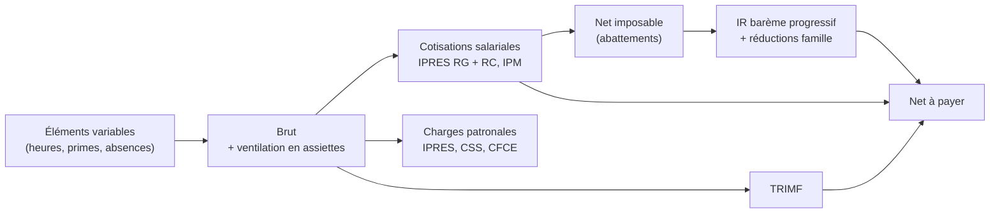
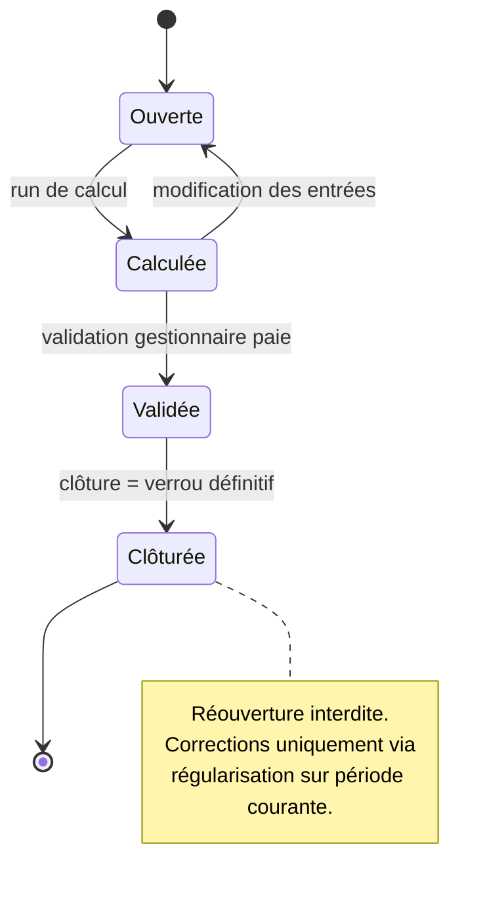
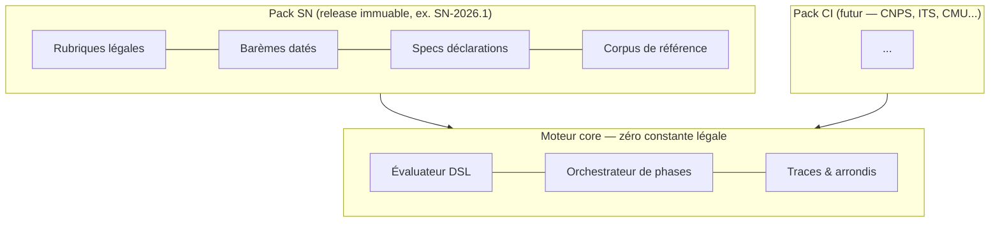

# Moteur de paie, sécurité et conformité

> **Positionnement.** Payfit a gagné la France en industrialisant un moteur de paie configurable ; Deel a gagné l'international en industrialisant le multi-pays. Personne n'a encore fait les deux pour l'UEMOA. Ce chapitre pose les fondations qui rendent cela possible avec 1-2 développeurs : un moteur petit mais irréprochable, et tout le « légal » isolé dans des packs pays remplaçables.

## 1. Le moteur de paie : cœur différenciant

### 1.1 Principes non négociables

1. **Fonction pure.** Le moteur est une bibliothèque sans I/O : `calculer(dossierEmployé, périodePaie, packRéglementaire@version, paramètresEmployeur) → (bulletin, trace)`. Pas d'accès horloge, base ou réseau pendant le calcul. C'est ce qui rend le recalcul à l'identique et les tests en masse possibles.
2. **Arithmétique décimale.** Aucun flottant. Calculs internes en décimal (6 décimales), arrondi **par rubrique** selon la règle du pack. Le XOF n'a pas de subdivision en pratique : montants finaux arrondis à l'unité FCFA.
3. **Déterminisme versionné.** Chaque bulletin référence la version exacte du pack réglementaire et un instantané (snapshot + hash) de ses entrées. Rejouer le calcul en 2029 sur une paie de 2026 produit le même résultat au FCFA près.
4. **Explicabilité native.** La trace de calcul n'est pas un log : c'est une sortie de première classe du moteur (§6.1).

### 1.2 Rubriques de paie déclaratives

Une rubrique (earning, deduction, cotisation patronale, ligne informative) est une définition déclarative :

```
Rubrique {
  code: "PRIME_ANCIENNETE",  type: GAIN | RETENUE_SALARIALE | CHARGE_PATRONALE | INFO,
  assiettes_alimentées: ["BRUT", "BRUT_SOCIAL", "BRUT_FISCAL"],   // à quelles bases elle contribue
  formule: "anciennete_annees >= 2 ? salaire_categoriel * 0.01 * anciennete_annees : 0",
  arrondi: UNITE, imposable: true, cotisable: true,
  ordre: 120, effet: [date_debut, date_fin]
}
```

**Décision — trois niveaux de rubriques :**

| Niveau                                                    | Qui les définit                        | Comment                                                                  |
| --------------------------------------------------------- | -------------------------------------- | ------------------------------------------------------------------------ |
| **Légales** (IPRES, IR, TRIMF…)                           | Le pack pays                           | Code + tables de barèmes, release immuable, non modifiable par le client |
| **Conventionnelles** (prime d'ancienneté CCNI, préavis…)  | Le pack pays, activables/paramétrables | Déclaratif livré, paramètres client                                      |
| **Client** (prime de performance, indemnité télétravail…) | Le client via l'UI                     | DSL d'expressions restreint                                              |

**Le DSL client est volontairement pauvre** : expressions arithmétiques, conditionnelles, accès à un dictionnaire de variables typées (salaire de base, ancienneté, catégorie CCNI…). Pas de boucles, pas d'I/O, pas d'appels de fonction arbitraires. Évaluation sandboxée, parsée en AST validé à la sauvegarde (jamais d'`eval`).

**Alternatives écartées :** (a) tout en code dur — chaque spécificité client exigerait un déploiement, inacceptable en SaaS ; (b) moteur de règles générique type Drools/JSON-rules — over-engineering, débogage opaque, personne ne saura le maintenir à deux développeurs ; (c) formules libres type Excel/JS — indéterminisme et surface d'attaque.

### 1.3 Versionnement temporel des règles

Le problème canonique : le barème IR change au 1er janvier ; les paies de décembre doivent rester recalculables à l'identique, et un rappel de décembre payé en février doit utiliser les règles de décembre.

**Décision : versionnement bitemporel.**

- Chaque règle/barème porte une **date d'effet légale** (`effective_from`/`effective_to`) : quel droit s'applique à quelle période de paie.
- Chaque **release de pack** (ex. `SN-2026.1`) est un artefact immuable et daté : quand la connaissance du droit a été embarquée. Une release contient l'historique complet des barèmes, pas seulement les derniers.
- Le run de paie résout : `règles = pack@release.pour_période(décembre 2026)`. Corriger une erreur de transcription d'un barème = nouvelle release (`SN-2026.2`) + note de changement ; les bulletins déjà émis gardent leur référence d'origine.

### 1.4 Séquencement du calcul



Le séquencement est un **graphe de dépendances explicite** entre phases, déclaré par le pack pays (l'ordre brut → cotisations → net imposable → IR → net à payer est sénégalais, pas universel). Le moteur détecte les cycles à la validation. À l'intérieur d'une phase, les rubriques s'exécutent par `ordre` croissant.

### 1.5 Régularisations rétroactives

Cas réels : augmentation signée en mars avec effet janvier, absence saisie en retard, taux AT notifié rétroactivement.

**Décision : recalcul différentiel, jamais de réouverture.**

1. Les entrées d'une période clôturée changent → le moteur **recalcule la période passée avec ses règles d'époque** (bitemporalité, §1.3).
2. Diff ligne à ligne contre le bulletin émis → génération automatique de **rubriques de rappel** (positives ou négatives) injectées dans la période courante, avec référence à la période d'origine.
3. Le traitement fiscal/social du rappel (cotisé/imposé sur la période de versement ou d'origine — règle sénégalaise **à vérifier** avec l'expert-comptable) est une politique du pack pays.

### 1.6 Simulation, run réel, cycle de vie des périodes

Même moteur pour tout : la simulation (« que donnerait cette embauche à 850 000 FCFA ? », onboarding d'un prospect avec ses vraies données) est un run flaggé `simulation=true`, sans effet de bord, résultats éphémères ou stockés à part. C'est gratuit architecturalement et c'est un outil de vente.



La clôture verrouille en base (contrainte + couche policy) toute écriture sur la période : bulletins scellés (§6.2), numérotation séquentielle sans trou par employeur, déclenchement des exports déclaratifs et des ordres de paiement (virement, Wave/Orange Money — chapitre paiements).

## 2. Pack Sénégal et architecture multi-pays

### 2.1 Prélèvements sénégalais (tous les chiffres : **à vérifier** avant mise en production)

| Prélèvement                | Salarié             | Employeur           | Plafond mensuel | Notes                                                                      |
| -------------------------- | ------------------- | ------------------- | --------------- | -------------------------------------------------------------------------- |
| IPRES régime général       | 5,6 %               | 8,4 %               | ~432 000 FCFA   | Taux global 14 % — **à vérifier** (plafond révisé périodiquement)          |
| IPRES régime cadres        | 2,4 %               | 3,6 %               | ~1 296 000 FCFA | Cadres uniquement, en sus du RG — **à vérifier**                           |
| CSS prestations familiales | —                   | 7 %                 | ~63 000 FCFA    | **à vérifier**                                                             |
| CSS accidents du travail   | —                   | 1 / 3 / 5 %         | ~63 000 FCFA    | Taux selon classe de risque de l'employeur — **à vérifier**                |
| IPM (maladie)              | variable            | variable            | —               | Affiliation obligatoire, taux propres à chaque IPM → rubrique paramétrable |
| IR (retenue à la source)   | barème progressif   | —                   | —               | Voir ci-dessous                                                            |
| TRIMF                      | forfait par tranche | —                   | —               | Ordre de grandeur 300–1 500 FCFA/mois — barème **à vérifier**              |
| CFCE                       | —                   | 3 % masse salariale | —               | **à vérifier** (exonérations possibles selon statut)                       |

**IR — mécanique (à faire valider intégralement) :** base = brut fiscal − cotisations sociales salariales obligatoires − abattement forfaitaire de 30 % plafonné (~900 000 FCFA/an — **à vérifier**) ; barème annuel progressif par tranches (0 % → 40 %, seuils du CGI — **à vérifier**) ; puis **réduction d'impôt pour charges de famille** par nombre de parts (0,5 à 5 parts), chaque niveau ayant un taux de réduction encadré par un minimum et un maximum — c'est une réduction sur l'impôt calculé, **pas** un quotient familial à la française. Table complète des parts/taux/min/max : **à vérifier**. Mensualisation selon la méthode DGID en vigueur (**à vérifier**).

Le pack embarque aussi les règles CCNI 2019 (prime d'ancienneté, préavis, indemnités de fin de contrat, catégories) et les exonérations usuelles (indemnité de transport dans la limite légale, avantages en nature au barème DGID — **à vérifier**).

**Livrable critique : le corpus de référence.** 30 à 50 bulletins couvrant les cas types (cadre/non-cadre, parts multiples, plafonds atteints, rappels, entrée/sortie en cours de mois), calculés à la main et **validés par un expert-comptable sénégalais** (budget : ~2–4 M FCFA, à contractualiser). Chaque release du pack doit reproduire le corpus à l'identique en CI. Ce corpus est un actif métier au même titre que le code — c'est lui qui autorise à écrire « conforme » sur le site.

### 2.2 Déclarations périodiques (échéances exactes **à vérifier**)

| Déclaration                             | Destinataire | Périodicité                                                      | Contenu                         |
| --------------------------------------- | ------------ | ---------------------------------------------------------------- | ------------------------------- |
| Retenues à la source (IR, TRIMF) + CFCE | DGID (e-Tax) | Mensuelle                                                        | État des retenues du mois       |
| Bordereau de cotisations                | CSS et IPRES | Mensuelle (≥ 20 salariés) / trimestrielle sinon — **à vérifier** | Assiettes plafonnées, effectifs |
| État récapitulatif annuel des salaires  | DGID         | Annuelle (janvier — **à vérifier**)                              | Récap par salarié               |

V1 : génération des états au format attendu (PDF/tableur conformes aux formulaires) + rappels d'échéance. Télétransmission automatique (e-Tax, téléprocédures CSS/IPRES) : phase 2, si et quand des API existent — ne rien promettre ici.

### 2.3 Architecture « pack pays »



Le pack implémente une interface unique : `rubriques légales`, `plan de phases`, `barèmes datés`, `règles conventionnelles`, `specs de déclarations`, `validations`. Ajouter la Côte d'Ivoire = écrire un pack `CI` + son corpus de référence (estimation : 1,5–2 mois par pays UEMOA, dégressif car les structures se ressemblent), **zéro modification du moteur**. Les packs sont du code + des données versionnés dans le monorepo, publiés comme releases signées — pas des lignes de configuration modifiables en production.

## 3. Sécurité applicative

### 3.1 Authentification — décision : interne et maîtrisée

- **Mots de passe : Argon2id**, paramètres ≥ OWASP (m = 64 MiB, t = 3, p = 1), longueur minimale 12, contrôle de compromission via l'API k-anonymity HIBP, pas d'expiration périodique forcée.
- **MFA TOTP obligatoire** pour admin, RH et gestionnaire paie ; optionnelle (fortement suggérée) pour managers et employés. Codes de récupération à usage unique. WebAuthn/passkeys : phase 2.
- **SSO entrant OIDC** (Google Workspace, Entra ID) en phase 2 via une bibliothèque certifiée (`openid-client` ou équivalent) ; **SAML** seulement quand un client entreprise le paiera — jamais avant.

**Écartés :** Auth0/Clerk (coût en USD croissant, données d'identité hors périmètre, dépendance sur le composant le plus critique) ; Keycloak/Zitadel self-hosted (une brique JVM/infra de plus à opérer à deux — plus lourd que d'écrire login + TOTP avec des bibliothèques éprouvées, périmètre qui reste maîtrisé et audité).

### 3.2 Sessions

Sessions **opaques côté serveur** (Redis) livrées en cookie `HttpOnly; Secure; SameSite=Lax`, expiration glissante 12 h + expiration absolue 7 j, invalidation immédiate à la déconnexion, au changement de mot de passe et par l'admin (« déconnecter partout »). **Écarté : JWT stateless comme session** — la révocation immédiate est non négociable dans un produit RH (un licenciement retire l'accès à la seconde). Les JWT restent pertinents plus tard pour l'API publique machine-to-machine.

### 3.3 Autorisation : RBAC + périmètres

| Rôle               | Périmètre par défaut              | Capacités clés                             | Ne peut pas                             |
| ------------------ | --------------------------------- | ------------------------------------------ | --------------------------------------- |
| Admin organisation | Organisation                      | Tout, gestion rôles et config              | —                                       |
| RH                 | Organisation                      | Dossiers employés, contrats, absences      | Configurer/lancer la paie               |
| Gestionnaire paie  | Organisation                      | Rubriques, runs, clôture, déclarations     | Gérer les comptes utilisateurs          |
| Manager            | Son équipe (hiérarchie récursive) | Valider congés/absences, dossier restreint | Voir les salaires, sortir de son équipe |
| Employé            | Lui-même                          | Ses bulletins, ses demandes, ses données   | Tout le reste                           |

- Permissions fines `module.ressource.action` (ex. `paie.bulletin.lire`), un rôle = un ensemble de permissions ; l'**attribution** d'un rôle porte le **périmètre** (organisation / entité / équipe / soi-même). Rôles personnalisés : phase 2, le modèle le permet déjà.
- **Enforcement exclusivement serveur**, dans une couche policy unique appelée par tous les points d'entrée (API, exports, jobs). Déni par défaut. Le front ne fait que masquer.
- **Tests d'accès automatisés en CI** : matrice rôle × endpoint × périmètre — c'est le seul moyen d'empêcher les régressions d'autorisation, première cause d'incident dans les SaaS RH.
- Option **validation à quatre yeux** sur la clôture de paie et les changements de RIB (activable par client — attendu du secteur public type APIX).

### 3.4 OWASP, rate limiting, secrets

- **OWASP Top 10** : requêtes paramétrées via l'ORM (jamais de SQL concaténé), encodage de sortie systématique, CSP stricte, protection CSRF (SameSite + token sur mutations), contrôle d'accès objet par objet (anti-IDOR : tout ID vérifié contre le tenant et le périmètre), en-têtes de sécurité (HSTS, X-Content-Type-Options…), scan de dépendances et d'images en CI (Dependabot + Trivy), uploads restreints par type/taille et servis hors domaine principal.
- **Rate limiting** (Redis, token bucket) : par IP sur les endpoints anonymes (login, reset : ~5/15 min), par compte avec backoff exponentiel — verrouillage progressif, jamais définitif (sinon DoS trivial sur un compte connu). Limites globales API : ~100 req/min/session.
- **Secrets** : gestionnaire de secrets du cloud retenu, injection à l'exécution, zéro secret dans le dépôt ou les images, rotation documentée, IAM au moindre privilège. **Écarté : Vault self-hosted** (charge opérationnelle injustifiée à cette taille).

## 4. Conformité données personnelles

### 4.1 Double cadre : RGPD + loi 2008-12 (CDP)

Teranga RH est **sous-traitant** (au sens art. 28 RGPD et équivalent sénégalais) pour les données employés de ses clients, et **responsable de traitement** pour ses propres traitements (comptes, facturation, télémétrie). Conséquences :

- **DPA type** signé avec chaque client dès le premier contrat (APIX incluse) : objet, sous-traitants ultérieurs listés, mesures techniques (ce chapitre en est l'annexe), localisation, assistance aux droits, notification de violation < 72 h.
- **Registre des traitements** tenu dès le premier jour (le nôtre) + **registre pré-rempli fourni au client** pour ses propres obligations.
- **Spécificité sénégalaise** : la loi 2008-12 maintient des **formalités préalables auprès de la CDP** (déclaration, voire autorisation pour certaines catégories) que le RGPD a abandonnées, et soumet les **transferts hors du Sénégal à formalités** (modalités exactes **à vérifier** avec un conseil local ; une réforme de la loi est en discussion — veille nécessaire). **Décision produit : livrer un « kit CDP »** (fiches de déclaration pré-remplies pour le traitement paie/RH) — coût marginal, différenciateur réel face aux acteurs internationaux qui ignorent la CDP.

### 4.2 Droits des personnes — et leurs limites en paie

Accès, rectification, portabilité : self-service dans l'espace employé (export de ses données et bulletins). **Effacement : refus motivé et outillé** — les bulletins et données de paie sont soumis à conservation légale obligatoire ; la réponse conforme est la **limitation** (gel d'accès, minimisation) puis la purge à échéance. Le produit génère la réponse motivée citant les bases légales, au lieu de laisser chaque client improviser.

### 4.3 Durées de conservation et purge

| Catégorie                               | Conservation                                 | Base (à confirmer par conseil juridique)        |
| --------------------------------------- | -------------------------------------------- | ----------------------------------------------- |
| Bulletins, livres et journaux de paie   | 10 ans après émission                        | OHADA, documents comptables — **à vérifier**    |
| Dossier contractuel (contrat, avenants) | Contrat + 5 à 10 ans                         | Prescriptions sociales/civiles — **à vérifier** |
| Déclarations fiscales et sociales       | 10 ans                                       | CGI/OHADA — **à vérifier**                      |
| Candidatures non retenues               | 6 mois puis purge                            | Doctrine CNIL/CDP                               |
| Logs applicatifs                        | 12 mois                                      | Sécurité                                        |
| Journal d'audit                         | 3 ans en ligne + archive alignée sur la paie | Traçabilité                                     |

Purge **automatisée** : moteur de rétention par catégorie et par pays (les durées sont des données du pack pays), job planifié, chaque purge journalisée. La rétention manuelle « on verra » est une non-conformité programmée.

### 4.4 Résidence des données — recommandation ferme

| Option                                            | Latence depuis Dakar                                                     | Analyse                                                                                                                | Verdict      |
| ------------------------------------------------- | ------------------------------------------------------------------------ | ---------------------------------------------------------------------------------------------------------------------- | ------------ |
| **Région UE – Paris**                             | ~70–100 ms (câbles vers l'Europe — **à vérifier** en conditions réelles) | RGPD natif, écosystème managé complet, coûts standards ; reste un transfert hors Sénégal → formalités CDP              | **Retenu**   |
| Régions africaines (Le Cap, Johannesburg)         | ~150–200 ms                                                              | Toujours un transfert hors Sénégal (aucun gain juridique), services managés plus pauvres, latence pire                 | Écarté       |
| Hébergement local (Sénégal Numérique, opérateurs) | < 10 ms                                                                  | Souveraineté maximale, argument secteur public ; mais quasi aucun service managé → charge ops incompatible avec 2 devs | Écarté en V1 |

**Décision : Paris au lancement**, formalités de transfert CDP intégrées au kit client. **Assurance de réversibilité** : toute l'infrastructure en IaC, conteneurs, PostgreSQL standard — redéployable chez un hébergeur sénégalais si un client public (l'APIX la première) l'exige contractuellement ; ce serait alors une offre « souveraine » facturée en conséquence, pas le défaut. Vérifier tôt les exigences d'hébergement de l'APIX : c'est le seul risque qui pourrait inverser cette décision.

## 5. Chiffrement et gestion des clés

- **En transit** : TLS 1.2 minimum, 1.3 préféré, HSTS (preload), TLS aussi sur les liens internes ou réseau privé strict.
- **Au repos** : chiffrement volumes + base + sauvegardes via le KMS du cloud (AES-256). Acquis de base, pas un argument de sécurité en soi.
- **Applicatif (par champ)** : AES-256-GCM en **chiffrement d'enveloppe** — DEK par tenant, chiffrée par une KEK dans le KMS, identifiant de version de clé stocké avec chaque ciphertext (rotation sans re-chiffrement massif ; rotation KEK annuelle). Champs concernés : **RIB/IBAN, numéros mobile money, numéro national d'identification (CNI/NIN), pièces d'identité stockées**. Interdiction produit de stocker des motifs médicaux (les arrêts maladie portent des dates, jamais des diagnostics).
- **Décision assumée : les salaires ne sont pas chiffrés par champ.** Ils alimentent calculs, agrégations et rapports SQL ; le chiffrement champ les rendrait inutilisables ou pousserait vers des contournements pires. Protection : RBAC strict (§3.3) + audit des consultations (§6.3) + chiffrement au repos.
- Clés jamais en base ni dans le code ; accès KMS via IAM au moindre privilège ; procédure de crypto-shredding documentée (supprimer la DEK d'un tenant sortant vaut effacement de ses ciphertexts, y compris dans les sauvegardes).

## 6. Audit et traçabilité niveau paie

### 6.1 Trace de calcul : chaque montant est explicable

Le moteur émet, pour **chaque ligne** de bulletin, un arbre d'explication : rubrique et version (`SN.IR@2026.1`), entrées avec leur provenance, étapes intermédiaires (tranche par tranche pour un barème), arrondis appliqués. Stocké compressé avec le bulletin (ordre de grandeur : quelques Ko/bulletin — négligeable).

```json
{
  "ligne": "IR",
  "montant": -131900,
  "regle": "SN.IR@2026.1",
  "entrees": { "netImposableAnnuel": 7620000, "parts": 2.5 },
  "etapes": [
    { "op": "bareme_progressif", "ref": "SN.IR.bareme@2026-01-01", "resultat": 1978500 },
    { "op": "reduction_famille", "taux": 0.2, "min": 300000, "max": 1100000, "resultat": -395700 },
    { "op": "mensualisation", "resultat": 131900 }
  ]
}
```

Exposée dans l'UI (« expliquer ce montant ») pour le gestionnaire **et** en version pédagogique pour l'employé. C'est simultanément l'outil de débogage du moteur, la réponse aux contrôles fiscaux/sociaux, et un différenciateur produit visible — aucun acteur local ne l'offre.

### 6.2 Immuabilité des bulletins émis

À la clôture : sérialisation **JSON canonique** du bulletin + trace, hachage SHA-256, **chaînage** (`hash_n = SHA256(bulletin_n ‖ hash_{n-1})`) par employeur, ancre de chaîne répliquée quotidiennement dans un stockage objet distinct en mode WORM (object lock), PDF scellé généré et archivé. Toute altération a posteriori est détectable par re-vérification de la chaîne. **Écarté : blockchain** — le chaînage de hachage fournit la même preuve d'intégrité pour un coût nul et zéro dépendance.

### 6.3 Journal d'audit

Table **append-only** (aucun droit UPDATE/DELETE pour le rôle applicatif, partitionnée par mois) : qui, quoi, quand, depuis où, sur quel objet. Événements obligatoires : authentifications et échecs, changements de rôles/permissions, **consultations de salaires et exports**, modifications de RIB, changements de rubriques et de paramètres de paie, clôtures et tentatives d'écriture sur période close. Consultable par l'admin client (transparence contractuelle), conservé 3 ans en ligne puis archivé.

## 7. Synthèse des décisions et effort

| #   | Décision                                                                                       | Alternative écartée                                |
| --- | ---------------------------------------------------------------------------------------------- | -------------------------------------------------- |
| 1   | Moteur = fonction pure versionnée, arithmétique décimale, traces natives                       | Calcul « dans les services » dispersé              |
| 2   | Packs pays immuables (code + barèmes datés), corpus de référence validé par expert-comptable   | Constantes légales dans le code ou en config libre |
| 3   | Bitemporalité + régularisations différentielles, périodes closes inviolables                   | Réouverture de périodes                            |
| 4   | Auth interne Argon2id + TOTP, sessions serveur, OIDC en phase 2                                | Auth0/Clerk, Keycloak, sessions JWT                |
| 5   | RBAC 5 rôles + permissions fines + périmètres, policy serveur unique testée en CI              | ACL ad hoc par endpoint                            |
| 6   | Hébergement Paris + réversibilité souveraine en IaC                                            | Région africaine, hébergement local V1             |
| 7   | Chiffrement d'enveloppe limité aux champs ultra-sensibles ; salaires protégés par RBAC + audit | Chiffrement champ généralisé                       |
| 8   | Bulletins scellés par hachage chaîné + WORM                                                    | Blockchain                                         |

| Chantier                                                            | Effort (dev senior)            |
| ------------------------------------------------------------------- | ------------------------------ |
| Moteur core (rubriques, DSL, phases, traces, arrondis)              | 3–4 mois                       |
| Pack Sénégal + corpus validé (hors honoraires expert : ~2–4 M FCFA) | 1,5–2 mois                     |
| Auth + sessions + RBAC + tests d'accès                              | 1–1,5 mois                     |
| Chiffrement champ + KMS + secrets                                   | 2–3 semaines                   |
| Audit log + scellement bulletins                                    | 2–3 semaines                   |
| Kit conformité (registre, DPA, rétention/purge, kit CDP)            | 2 semaines + conseil juridique |
| **Total**                                                           | **≈ 7–9 mois-homme**           |

Soit environ 4 à 5 mois calendaires à deux développeurs, en parallèle des chantiers des autres chapitres. Les deux risques à traiter **avant** d'écrire le moteur : contractualiser l'expert-comptable pour le corpus de référence, et vérifier les exigences d'hébergement de l'APIX.
