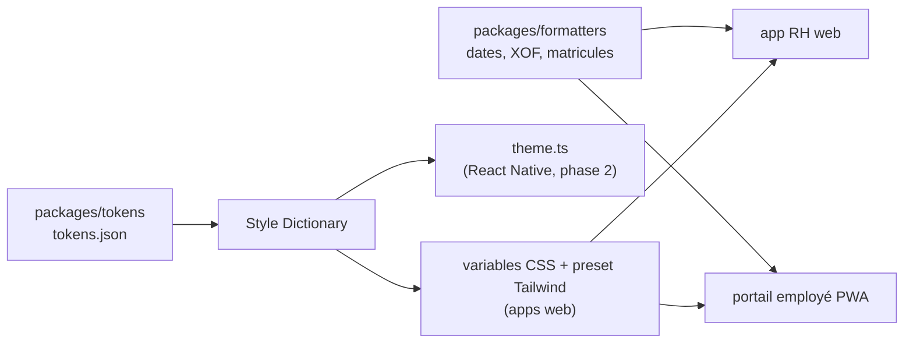
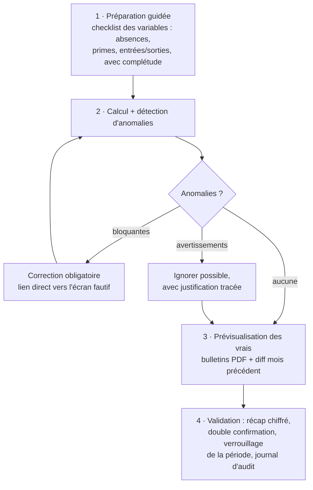

# Design system, UX et ergonomie

> **Décision en une ligne** : un design system maison bâti sur shadcn/ui + Radix + Tailwind, des tokens sémantiques partagés web/mobile via Style Dictionary, un seul composant DataTable pour toute l'app, et le run de paie traité comme le produit — pas comme un formulaire.

L'ambition « niveau Stripe/Linear » n'est pas un vœu esthétique : c'est une discipline d'ingénierie. La bonne nouvelle pour une équipe de 1-2 devs, c'est que cette qualité résulte à 90 % de **contraintes systématiques** (tokens, grille, composants uniques) et à 10 % de talent visuel. Ce chapitre fixe les contraintes.

## 1. Déconstruire la « qualité Stripe/Linear » : mécanismes, pas magie

Analyse froide de ce que l'utilisateur perçoit, et du mécanisme qui le produit :

| Perception                   | Mécanisme concret chez Stripe/Linear                                                                                                           | Traduction Teranga RH                                                                                                                                        |
| ---------------------------- | ---------------------------------------------------------------------------------------------------------------------------------------------- | ------------------------------------------------------------------------------------------------------------------------------------------------------------ |
| « C'est instantané »         | Optimistic UI sur les mutations réversibles, skeletons calqués sur la mise en page finale, prefetch des routes au survol, transitions < 200 ms | Valider un congé, éditer un champ employé : mise à jour optimiste + rollback. Skeleton par module, jamais de spinner plein écran après le premier chargement |
| « C'est dense mais lisible » | Grille 4 px stricte, une seule famille typographique, hiérarchie par graisse et couleur (pas par taille), lignes de table 36-40 px             | Registre du personnel à 40 px/ligne, 5 tailles de texte max par écran, montants en chiffres tabulaires alignés à droite                                      |
| « C'est pro »                | Micro-interactions 120-200 ms ease-out, jamais de bounce ; états vides qui vendent la fonctionnalité ; erreurs qui expliquent la correction    | Chaque état vide = illustration légère + phrase + bouton d'action. Chaque erreur = quoi / pourquoi / comment corriger                                        |
| « Je vais vite »             | Raccourcis clavier documentés, command palette Cmd+K, navigation clavier complète dans les listes                                              | Cmd+K dès la v1 : « aller à un employé », « lancer la paie d'août », « créer une absence »                                                                   |
| « C'est cohérent »           | Zéro composant ad hoc : tout écran est un assemblage du système                                                                                | Règle d'or : si un écran exige une valeur hors tokens, c'est le design de l'écran qui est faux                                                               |

**Dix principes actionnables** (affichés dans le README de `packages/ui/`, opposables en revue de code) :

1. Toute interaction produit un feedback en < 100 ms — optimiste si la mutation est réversible, sinon état de chargement localisé.
2. Skeletons fidèles à la mise en page finale ; le spinner plein écran est interdit après le premier chargement.
3. Grille d'espacement 4 px, aucune valeur arbitraire (`13px` est un bug).
4. Hiérarchie par graisse et couleur ; maximum 5 corps de texte par écran.
5. Animations 120-200 ms, ease-out, uniquement pour expliquer un changement d'état — jamais pour décorer.
6. Chaque état vide propose l'action suivante ; un tableau vide sans bouton est un écran cassé.
7. Chaque message d'erreur dit quoi s'est passé, pourquoi, et comment corriger — en français d'humain, pas en code d'erreur.
8. Tout est opérable au clavier ; Cmd+K dès la v1.
9. Tout montant : `font-variant-numeric: tabular-nums`, aligné à droite, format XOF.
10. Un écran = une action principale visuellement évidente.

## 2. Design system

### 2.1 Bibliothèque de composants : décision ferme

**Recommandation : shadcn/ui (primitives Radix UI) + Tailwind CSS, copié dans `packages/ui/` et traité comme du code maison.**

| Option                           | Propriété du code                    | Accessibilité                     | Atteinte du « niveau Linear »                                          | Coût initial | Verdict                                                                                                                                              |
| -------------------------------- | ------------------------------------ | --------------------------------- | ---------------------------------------------------------------------- | ------------ | ---------------------------------------------------------------------------------------------------------------------------------------------------- |
| **shadcn/ui + Radix + Tailwind** | Totale (le code est copié chez nous) | Radix couvre focus, ARIA, clavier | Élevée — esthétique par défaut déjà proche, personnalisation illimitée | ~1 semaine   | **Retenu**                                                                                                                                           |
| Mantine                          | Dépendance à la lib et à son theming | Bonne                             | Moyenne — on lutte contre un style existant pour s'en démarquer        | ~3 jours     | Écarté : excellent framework, mais le polish différenciant passe par une surcouche de theming fragile ; identité visuelle « Mantine » reconnaissable |
| MUI                              | Dépendance forte                     | Bonne                             | Faible — Material = identité Google, poids élevé, densité difficile    | ~3 jours     | Écarté                                                                                                                                               |
| From scratch                     | Totale                               | À reconstruire entièrement        | Théoriquement maximale                                                 | 4-6 mois     | Écarté : refaire le focus management et l'ARIA de Radix est de l'over-engineering caractérisé pour 2 devs                                            |

Justifications décisives pour shadcn/ui :

- **Le code nous appartient** : pas de bataille contre un thème, pas de breaking change subi, un composant se modifie comme n'importe quel fichier du repo.
- **Radix résout ~80 % de l'accessibilité** (dialogues, menus, comboboxes : focus trap, ARIA, clavier) — le poste le plus coûteux d'un design system maison.
- **Effet écosystème 2024-2026** : standard de facto, énormément de matériel de référence — un dev solo assisté par IA est objectivement plus productif sur ce stack que sur tout autre.
- Command palette : **cmdk** (même auteur, s'intègre nativement).

Au-dessus de la base shadcn, ~15-20 composants métier à construire : `DataTable`, `Money` (affichage) et `MoneyInput`, `DatePicker` localisé fr, `EmptyState`, `Stepper`, `AnomalyCard`, `DiffBadge`, `StatCard`, `FileUpload`, `EmployeeAvatar`. C'est là que vit la valeur propriétaire.

### 2.2 Tokens : la source unique de vérité

Package `packages/tokens/` — un JSON de tokens, aucune valeur de style définie ailleurs.

| Catégorie   | Contenu                                                                                                                                                                                                                | Règles                                                                                                              |
| ----------- | ---------------------------------------------------------------------------------------------------------------------------------------------------------------------------------------------------------------------- | ------------------------------------------------------------------------------------------------------------------- |
| Couleurs    | Palette primitive (échelles 50-950) **jamais référencée par les composants** ; tokens sémantiques : `bg.surface`, `bg.subtle`, `text.default`, `text.muted`, `border.default`, `accent`, `success/warning/danger/info` | Les composants ne consomment que le sémantique. Contrastes AA vérifiés par script sur le JSON                       |
| Dark mode   | Redéfinition des seuls tokens sémantiques                                                                                                                                                                              | **Dès le premier jour** : coût ~2 jours à la création, ~2 mois en rétrofit. Attendu par la cible « qualité Linear » |
| Espacement  | Échelle 4 px : 4, 8, 12, 16, 24, 32, 48, 64                                                                                                                                                                            | Aucune valeur hors échelle                                                                                          |
| Typographie | **Inter variable**, self-hosted, subset latin (~40 KB woff2) ; corps 12/13/14/16/20/24/32 ; `tabular-nums` pour tout chiffre                                                                                           | Une seule famille. Pas de font Google en runtime (latence + RGPD)                                                   |
| Radius      | 4 / 6 / 8 px + full                                                                                                                                                                                                    |                                                                                                                     |
| Ombres      | 3 niveaux, subtiles                                                                                                                                                                                                    |                                                                                                                     |
| Motion      | Durées 120/180/240 ms + 2 easings                                                                                                                                                                                      |                                                                                                                     |

### 2.3 Partage web / React Native

**Décision : on partage les tokens, les icônes (lucide) et les formatters — jamais les composants.** Les postures web (dense) et mobile (simple) divergent trop pour qu'un composant partagé soit autre chose qu'un compromis médiocre.



Corollaire tranché : **le portail employé démarre en PWA responsive, pas en React Native**. Le pipeline de tokens rend la sortie RN prête le jour venu (phase 2, si les besoins natifs — biométrie, notifications push riches — le justifient), mais on ne paie pas le coût d'une seconde plateforme au lancement.

## 3. Patterns UX critiques d'un SaaS RH

### 3.1 Tableaux de données : un seul composant, puissant

**Décision : `<DataTable>` unique dans `packages/ui`, bâti sur TanStack Table (headless) + TanStack Virtual. Toute table ad hoc est refusée en revue.**

Exigences non négociables :

- **Tri** multi-colonnes ; **filtres persistés dans l'URL** (lib `nuqs`) → un filtre est partageable par lien et survit au refresh, pattern Linear.
- **Colonnes configurables** (visibilité, ordre, épinglage) persistées **par utilisateur côté serveur**.
- **Volumes** : pagination serveur par défaut ; virtualisation dès ~200 lignes rendues ; 10 000 employés = pagination serveur + recherche indexée, jamais 10 000 lignes dans le DOM.
- **Export** : CSV/XLSX généré **côté serveur** ; au-delà de ~1 000 lignes, job asynchrone + notification (évite les timeouts sur connexion instable).
- Densité 36-40 px/ligne, navigation clavier (flèches, Entrée = ouvrir), sélection multiple + actions groupées.

### 3.2 Formulaires longs : le dossier employé

**Stack : react-hook-form + zod, schémas zod partagés avec l'API** (une seule source de validation).

- Découpage en **sections navigables** (état civil, contrat, rémunération, documents) avec sommaire ancré et indicateur de complétude — pas un formulaire de 80 champs.
- **Sauvegarde automatique en brouillon** : debounce 2 s, PATCH partiel, indicateur « Enregistré à 14:32 ».
- **Résilience réseau** (réalité sénégalaise) : brouillon tamponné en IndexedDB, rejoué à la reconnexion. Perdre 20 minutes de saisie sur une coupure est éliminatoire pour le produit.
- Validation **inline au blur**, récapitulatif des erreurs en soumission, focus automatique sur la première erreur.

### 3.3 Wizards (onboarding employé, run de paie, déclarations)

- **État persisté côté serveur** : un wizard se quitte et se reprend, y compris depuis un autre poste.
- Machine à états en TypeScript simple (union discriminée des étapes + transitions explicites). **XState écarté** : courbe d'apprentissage injustifiée pour trois wizards.
- Chaque étape affiche sa position, ce qui reste, et permet de revenir sans perte.

### 3.4 Deux postures produit assumées

|             | App RH                             | Portail employé                                      |
| ----------- | ---------------------------------- | ---------------------------------------------------- |
| Utilisateur | RH/paie, usage quotidien intensif  | Employé, usage épisodique                            |
| Device      | Desktop d'abord                    | **Mobile-first** (PWA)                               |
| Densité     | Dense, tableaux, raccourcis, Cmd+K | Aérée, cartes, gros touch targets (≥ 44 px)          |
| Ton         | Sobre, outil de travail            | Chaleureux, vocabulaire simple                       |
| Référents   | Linear, Stripe Dashboard           | Revolut, portail Payfit employé                      |
| Langues     | fr, en                             | fr, en, **wolof** (vocabulaire réduit, ~300 chaînes) |

Mêmes tokens, mêmes primitives — assemblages et échelles différents. C'est le design system qui garantit la parenté visuelle malgré les deux postures.

## 4. Le run de paie : moment de vérité UX

Ce que Payfit a compris : la paie n'est pas un formulaire mais un **processus mensuel anxiogène**, et le produit vend la **confiance au moment de valider**. Décomposition à répliquer :



1. **Checklist guidée** : le run commence par « qu'est-ce qui a changé ce mois-ci ? » — absences importées, primes saisies, entrées/sorties — chaque poste avec un compteur de complétude. L'utilisateur sait toujours où il en est.
2. **Anomalies expliquées et actionnables**. Deux niveaux : _bloquante_ (net négatif, salaire sous le SMIG — taux en vigueur **à vérifier** —, cotisation IPRES au-delà du plafond) et _avertissement_ (écart > 20 % vs mois précédent sans élément variable explicatif, RIB manquant pour un virement). Chaque anomalie = **une phrase en français + un lien vers l'écran de correction** ; jamais un code d'erreur. Les avertissements sont ignorables avec justification tracée.
3. **Prévisualisation réelle** : les bulletins PDF affichés sont ceux qui seront émis, pas une approximation.
4. **Diff mois précédent** : table de variances par employé (brut, net, coût employeur), triable par écart, chaque écart explicable en un clic — « +50 000 FCFA : prime de rendement saisie le 12/08 ». C'est l'écran qui crée la confiance.
5. **Validation verrouillante** : récapitulatif agrégé (masse salariale, totaux IPRES, CSS, IR, TRIMF, CFCE), double confirmation, verrouillage de la période, journal d'audit. Toute réouverture est un événement tracé.

Principe directeur : **l'utilisateur ne valide jamais une paie qu'il ne comprend pas**. Chaque chiffre agrégé se décompose au clic jusqu'à la ligne de bulletin.

## 5. Accessibilité, i18n, performance

### 5.1 Accessibilité — cible WCAG 2.1 AA

- Radix couvre le clavier et l'ARIA des composants interactifs. Reste à notre charge : **contrastes** (4,5:1, vérifiés par script sur les tokens — automatique par construction), focus visible, labels de formulaire systématiques, `aria-live` sur les toasts, touch targets ≥ 44 px côté portail.
- **Gate CI** : addon a11y de Storybook (axe-core) + `eslint-plugin-jsx-a11y` en erreur. Coût marginal faible, dette évitée énorme.
- Argument commercial, pas seulement éthique : les appels d'offres publics (l'APIX en est un) intègrent de plus en plus l'accessibilité.

### 5.2 Internationalisation

- **i18next + format ICU**, avec **le français comme langue source** — pas de clés anglaises traduites : le fr est le défaut produit. Namespaces par module, chargés à la demande.
- Règles v1 : aucune chaîne en dur (règle ESLint dédiée), aucune concaténation de fragments, pluriels via ICU, dates via `Intl.DateTimeFormat('fr-SN')` avec fallback `fr-FR` (support navigateur de `fr-SN` **à vérifier** sur le parc Android cible).
- **XOF** : `Intl.NumberFormat` avec `currency: 'XOF'`, **zéro décimale** → « 1 250 000 F CFA ». Le composant `Money` est le seul autorisé à afficher un montant.
- **Wolof** : locale `wo` prévue pour le portail employé uniquement (~300 chaînes) ; aucune barrière technique si les règles ci-dessus sont tenues dès la v1. Coût de traduction estimé : quelques jours d'un traducteur, < 500 €.

### 5.3 Performance front — budgets contraignants

Contexte cible : Android milieu de gamme, réseau 3G/4G irrégulier (médiane mobile Sénégal). Budgets vérifiés en CI (Lighthouse CI + `size-limit`), tout dépassement bloque la PR :

| Métrique                  | Portail employé | App RH   | Moyen principal                                                 |
| ------------------------- | --------------- | -------- | --------------------------------------------------------------- |
| LCP (4G moyenne)          | **< 2 s**       | < 2,5 s  | SSR/streaming, images AVIF/WebP, fonts subset self-hosted       |
| JS initial (gzip)         | **< 180 KB**    | < 300 KB | Code splitting par module, toute lib > 30 KB justifiée en revue |
| INP                       | < 200 ms        | < 200 ms | Virtualisation, pas de re-render de liste complète              |
| Requêtes au premier écran | ≤ 15            | ≤ 25     | Cache SWR agressif, prefetch au survol                          |

Le portail employé est une **PWA avec service worker** : consultation des derniers bulletins et du solde de congés tolérante à la coupure réseau. Ce n'est pas du polish, c'est de l'adéquation au marché.

## 6. Organisation : produire de l'excellence sans designer

### 6.1 Structure du monorepo (volet front)

```
packages/
  tokens/        # JSON source + build Style Dictionary
  ui/            # composants purs : zéro logique métier, zéro appel réseau
  formatters/    # dates, XOF, matricules — partagés web/mobile
apps/
  rh/            # app RH (dense, desktop)
  portail/       # portail employé (PWA mobile-first)
```

Dépendance à sens unique : `apps/* → packages/*`, jamais l'inverse. Un composant de `ui/` qui a besoin de « savoir » un concept métier descend une prop, il n'importe pas le module métier.

### 6.2 Storybook et tests visuels

- **Storybook** obligatoire pour chaque composant de `ui/`, avec les états : défaut, hover, focus, disabled, erreur, vide, chargement, **dark**.
- **Tests visuels** : screenshots Playwright sur les stories critiques en CI (gratuit, dans le repo). Chromatic (gratuit jusqu'à 5 000 snapshots/mois) seulement quand l'équipe grandit — pas d'abonnement de plus au départ.
- **Tests d'interaction** via les play functions Storybook pour les composants complexes (DataTable, Wizard, MoneyInput).

### 6.3 Process design pour un dev solo : le système décide, pas l'inspiration

- **Aucune décision esthétique au moment de coder un écran** : les tokens et composants ont déjà décidé. Si un écran « a besoin » d'une exception, c'est la structure de l'écran qu'on revoit.
- **Un référent par famille d'écrans**, documenté : tables/listes → Linear ; settings et détails → Stripe Dashboard ; wizard de paie → Payfit ; portail employé → Revolut. On copie la **structure** (hiérarchie, densité, enchaînements), jamais les pixels.
- **Pas de Figma obligatoire en v1** : pour un dev solo, prototyper directement dans Storybook est plus rapide et ne désynchronise jamais design et code. Figma entre en scène avec le premier designer.
- **Designer freelance à deux moments précis** (budget total ~1 500-3 000 €) : (1) fondations visuelles — palette de marque, logo, ton — avant le premier écran ; (2) revue de polish avant le lancement commercial UEMOA.
- **Rituel hebdo « polish »** : 2 h/semaine dédiées exclusivement aux détails visuels, alimentées par une liste tenue en continu. C'est ce rituel, pas le talent, qui produit la finition Linear.

### 6.4 Effort estimé (1 dev expérimenté)

| Chantier                                                               | Effort               | Remarque                                                               |
| ---------------------------------------------------------------------- | -------------------- | ---------------------------------------------------------------------- |
| Tokens + pipeline Style Dictionary + dark mode                         | 1 semaine            | Une fois, puis marginal                                                |
| Base shadcn/ui customisée + Storybook + CI visuelle                    | 1,5-2 semaines       |                                                                        |
| DataTable complet (tri, filtres URL, colonnes, virtualisation, export) | 1,5-2 semaines       | Le composant le plus rentable du produit                               |
| Formulaires longs + autosave résilient                                 | 1 semaine            |                                                                        |
| Command palette + raccourcis                                           | 2-3 jours            |                                                                        |
| UX du run de paie (hors moteur de calcul)                              | 3-4 semaines         | Le différenciateur — ne pas rogner                                     |
| A11y + i18n en continu                                                 | ~10 % du temps front | Quasi gratuit si les règles sont posées dès la v1, ruineux en rétrofit |

**Total fondations : ~6-8 semaines** avant d'accélérer durablement — chaque écran suivant coûte alors 2 à 3 fois moins cher qu'en approche ad hoc, et la cohérence « niveau mondial » est un sous-produit mécanique du système plutôt qu'un effort permanent.
