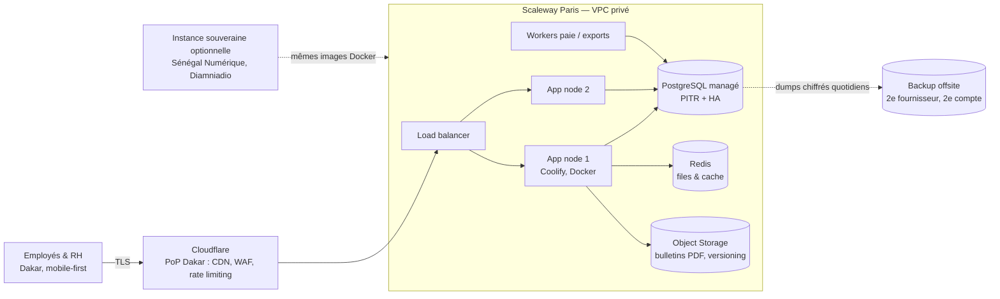

# Infrastructure, DevOps et exploitation

> **Principe directeur** : chaque heure passée sur l'infrastructure est une heure non passée sur le moteur de paie. L'objectif est un socle exploitable par 1-2 développeurs à **moins de 10 % de leur temps**, sans jamais transiger sur la donnée de paie : _une boîte de paie qui perd des données est morte_.

## 1. Hébergement : où faire tourner une paie depuis Dakar

### 1.1 Réalité réseau : le piège des « régions africaines »

Intuition fausse à évacuer d'emblée : héberger « en Afrique » ne rapproche pas de Dakar. Le trafic Dakar→Afrique du Sud transite le plus souvent par l'Europe (topologie des câbles sous-marins ACE / SAT-3 / 2Africa). Ordres de grandeur de RTT depuis Dakar (connexions Sonatel/Free, **à vérifier par mesures `mtr` réelles avant décision finale**) :

| Destination                                                        | RTT typique    | Commentaire                                                 |
| ------------------------------------------------------------------ | -------------- | ----------------------------------------------------------- |
| **Paris / Frankfurt**                                              | **60-110 ms**  | Meilleure connectivité depuis Dakar (câbles vers l'Europe)  |
| Londres / Amsterdam                                                | 70-120 ms      | Équivalent                                                  |
| US East (Virginie)                                                 | 120-180 ms     | Pénalise chaque appel API                                   |
| **Le Cap / Johannesburg** (AWS af-south-1, Azure/GCP South Africa) | **150-250 ms** | Souvent routé via l'Europe : pire que Paris                 |
| Edge Cloudflare Dakar                                              | 5-20 ms        | Cloudflare a un PoP à Dakar : assets statiques quasi locaux |

Conclusion réseau : **l'Europe de l'Ouest est la meilleure région pour servir Dakar**, et un CDN avec PoP à Dakar (Cloudflare) rend le front-end perçu comme local. Les régions sud-africaines n'apportent ni latence ni souveraineté (l'Afrique du Sud reste un pays tiers pour la loi sénégalaise).

### 1.2 Comparatif des quatre familles

| Critère                                      | (a) PaaS (Railway/Render/Fly.io)                     | (b) Hyperscaler managé (AWS ECS+RDS, Cloud Run+Cloud SQL) | (c) VPS Hetzner + Coolify                   | (d) **Cloud européen souverain (Scaleway/OVH) + Coolify**                         |
| -------------------------------------------- | ---------------------------------------------------- | --------------------------------------------------------- | ------------------------------------------- | --------------------------------------------------------------------------------- |
| Latence Dakar                                | Render/Railway : EU ok ; Fly : région CDG ok         | Paris (eu-west-3) ok ; af-south-1 : pire                  | Falkenstein/Helsinki : ok (~90-120 ms)      | Paris : **la meilleure** (~70-90 ms)                                              |
| Postgres managé + PITR                       | Partiel (Render : PITR payant ; Fly PG : non managé) | Excellent (RDS/Cloud SQL)                                 | **Absent** (à auto-héberger : rédhibitoire) | Oui (Scaleway/OVH Managed PG, HA en option)                                       |
| Coût MVP / 100 clients                       | ~100 $ / dérive à 1 500-3 000 $                      | ~350-500 $ / 3 000-6 000 $ + expertise                    | ~40 € / ~600 €                              | ~150 € / ~2 500 €                                                                 |
| Effort d'exploitation (1-2 devs)             | Minimal                                              | Élevé (VPC, IAM, NAT, ALB : un métier)                    | Moyen + **on porte la BDD soi-même**        | Faible-moyen                                                                      |
| Souveraineté / argumentaire client public    | Sociétés US, facturation USD                         | Cloud Act US ; af-south-1 ne résout rien                  | Allemagne, RGPD ok                          | **UE/France, RGPD, facturation EUR** (XOF arrimé à l'EUR : zéro risque de change) |
| Réversibilité vers un déploiement au Sénégal | Faible (lock-in PaaS)                                | Moyenne                                                   | Totale                                      | **Totale** (Docker + Postgres standard)                                           |

### 1.3 Souveraineté : ce que demandera l'APIX

La loi n° 2008-12 n'impose pas une localisation stricte, mais **tout transfert de données personnelles hors du Sénégal requiert une formalité auprès de la CDP** (déclaration/autorisation — régime exact **à vérifier avec un conseil local**). Plan en deux volets :

1. **Dès le pilote APIX** : dossier CDP couvrant l'hébergement en France (pays à protection adéquate via le RGPD), chiffrement au repos, clauses contractuelles, DPA fournisseur.
2. **Offre « souveraine » sur étagère** : parce que tout est packagé en images Docker standard (app, workers, Postgres, MinIO), on peut livrer une **instance single-tenant chez Sénégal Numérique SA (datacenter de Diamniadio, Tier 3)** ou un hébergeur local, facturée en supplément au client public qui l'exige. C'est un **différenciateur commercial** face à Payfit/Deel, pas une contrainte : on ne l'active que si un contrat le paie.

### 1.4 Recommandation ferme et chemin de migration

**Décision : Scaleway (région Paris) comme socle unique.** App sur 2 VPS + Coolify, **PostgreSQL managé** avec PITR, Object Storage S3-compatible, réseau privé (VPC), Cloudflare devant tout. OVHcloud est l'alternative interchangeable si un tarif ou un contrat cadre le justifie.

Écartés : **Hetzner** (imbattable en prix mais pas de Postgres managé — porter soi-même la BDD d'un produit de paie avec 1-2 devs est une faute professionnelle) ; **AWS/GCP dès le départ** (2 à 4× le coût, et surtout 2-3 semaines de mise en place puis une taxe cognitive permanente : VPC, IAM, NAT Gateway ~35 €/mois à lui seul) ; **PaaS US** (facturation USD, dérive de coûts, lock-in, argumentaire souveraineté faible face à un acheteur public sénégalais).

| Stade            | Socle                                                                                                            | Déclencheur de passage au stade suivant              |
| ---------------- | ---------------------------------------------------------------------------------------------------------------- | ---------------------------------------------------- |
| **MVP (APIX)**   | 2 VPS (app+workers / staging), PG managé 1 nœud, Coolify                                                         | Signature des premiers clients payants               |
| **~10 clients**  | 3 VPS app en rolling deploy, PG managé **HA (2 nœuds)**, staging isolé                                           | SLA contractuels ≥ 99,9 %, ou > 30 min/semaine d'ops |
| **~100 clients** | Option A (défaut) : Scaleway Kapsule (k8s managé) ; Option B : AWS eu-west-3 si des clients enterprise l'exigent | —                                                    |

La migration est triviale par construction : images Docker + Postgres standard (dump/restore ou réplication logique) + IaC minimal. **Test de reconstruction annuel** : remonter l'intégralité de la prod sur un compte vierge en < 1 journée, chronométré.

## 2. Environnements

Trois environnements, pas plus au départ :

| Env         | Contenu                                                                                                            | Données                                                                                 |
| ----------- | ------------------------------------------------------------------------------------------------------------------ | --------------------------------------------------------------------------------------- |
| **Local**   | `docker compose up` : Postgres, Redis, MinIO (S3), Mailpit (mails), app. Une commande, < 5 min de la clone au run. | Seed générée                                                                            |
| **Staging** | Copie de prod à échelle réduite, sur le VPS secondaire. Déploiement auto à chaque merge sur `main`.                | Seed générée — **jamais de vraies données de paie** (exigence RGPD/CDP, non négociable) |
| **Prod**    | Voir §1.4. Déploiement par promotion manuelle.                                                                     | Réelles                                                                                 |

**Seed data réaliste** — investissement rentabilisé mille fois : un générateur (Faker localisé) produisant une « entreprise sénégalaise type » de 250 salariés — noms, téléphones +221, NINEA, matricules IPRES/CSS plausibles, mix cadres/non-cadres, contrats CDI/CDD, situations familiales variées pour exercer le TRIMF et les parts fiscales. Le même jeu sert aux tests du moteur de paie, aux démos commerciales et au staging.

**Preview deployments** : Coolify sait déployer une app par PR. À activer au stade 2 avec une BDD éphémère par `CREATE DATABASE ... TEMPLATE seed_db`. Au MVP, staging suffit — ne pas sur-outiller.

## 3. CI/CD : GitHub Actions

### 3.1 Pipeline type

```mermaid
flowchart LR
  PR[Pull request] --> L[Lint + format<br/>Biome/ESLint]
  L --> T[Typecheck strict]
  T --> U[Tests unitaires<br/>moteur de paie inclus]
  U --> I[Tests d'intégration<br/>Postgres en service container]
  I --> M[Contrôle migrations :<br/>immutabilité + schéma à jour + dry-run]
  M --> B[Build image Docker → GHCR]
  B -->|merge main| S[Déploiement auto staging]
  S -->|tag + approbation manuelle<br/>GitHub Environment| P[Déploiement prod<br/>rolling avec healthchecks]
```

Règles : la **même image** est promue de staging en prod (jamais de rebuild) ; le pipeline complet doit tenir **< 10 min** sinon on le répare ; le contrôle de migrations échoue si une migration déjà mergée a été modifiée (append-only) ou si le schéma généré diverge des migrations ; rollback = redéployer le tag N-1, une commande.

### 3.2 Migrations sans downtime : expand/contract, sans exception

Le code déployé en version N doit fonctionner avec le schéma N **et** N+1 (rolling deploy oblige). Doctrine :

1. **Expand** (release N) : ajouts uniquement — nouvelle colonne nullable, nouvelle table, `CREATE INDEX CONCURRENTLY`. Double écriture si renommage.
2. **Backfill** (job asynchrone, par lots, jamais dans la migration) : remplir, puis poser les contraintes (`NOT NULL` via `CHECK ... NOT VALID` puis `VALIDATE`).
3. **Contract** (release N+2 au plus tôt) : suppression de l'ancienne colonne, une fois que plus rien ne la lit.

Garde-fous techniques : `lock_timeout = 5s` et `statement_timeout` sur toute session de migration ; interdiction en CI des patterns dangereux (`ALTER TABLE ... TYPE`, `DROP` en dehors d'une release contract). **Gel des déploiements en fenêtre de paie (du 25 au 5 du mois)** hors correctifs critiques : c'est la période où les clients calculent et versent les salaires.

### 3.3 Feature flags

Pas de LaunchDarkly (49 $+/mois et un SDK pour rien à ce stade). **Table Postgres maison** : `feature_flags(flag, tenant_id nullable, enabled, payload jsonb)`, cache in-process 30 s, accesseur typé. ~1 jour d'effort. Usages : activation progressive par tenant (APIX d'abord), **kill-switch** sur les modules risqués (version du moteur de paie, paiements Wave/Orange Money, envois DSN-like), démo commerciale de modules non GA. Unleash auto-hébergé seulement si le besoin de ciblage complexe émerge (probablement jamais avant 50 clients).

## 4. Base de données en production

### 4.1 Managé, point final

|                                 | Postgres managé (Scaleway/OVH/RDS) | Auto-hébergé (VPS)                                                          |
| ------------------------------- | ---------------------------------- | --------------------------------------------------------------------------- |
| PITR, failover, patchs sécurité | Inclus                             | À construire (pgBackRest, Patroni…) : 2-4 semaines + astreinte à vie        |
| Coût MVP                        | ~40-80 €/mois                      | ~15 €/mois + **le vrai coût : le risque**                                   |
| Verdict                         | **Retenu**                         | Écarté : l'économie de 50 €/mois ne vaut pas une seule fiche de paie perdue |

### 4.2 Backups : stratégie 3-2-1 et test de restauration

- **PITR 14 jours** via le fournisseur (WAL archiving) → RPO ≤ 15 min. (Granularité PITR exacte de l'offre Scaleway : **à vérifier au moment du choix de plan**.)
- **Dump logique quotidien** (`pg_dump` custom format), chiffré (`age`), poussé vers **un second fournisseur ET un second compte** (ex. bucket Backblaze B2 ou Hetzner Storage Box avec object lock) : survit à la compromission du compte principal.
- **Test de restauration mensuel automatisé** — le backup qui n'a jamais été restauré n'existe pas : un job GitHub Actions planifié restaure le dernier dump sur une instance jetable, exécute des contrôles d'intégrité (comptages, somme des nets à payer du dernier run de paie comparée à une valeur de contrôle stockée), poste le résultat sur Slack, détruit l'instance. Échec = alerte P1.
- **Exercice PITR semestriel manuel** (restauration à T-3h), chronométré, consigné dans le runbook.

### 4.3 Rétention

| Donnée                                                                     | Rétention  | Justification                                                                                                          |
| -------------------------------------------------------------------------- | ---------- | ---------------------------------------------------------------------------------------------------------------------- |
| PITR                                                                       | 14 jours   | Erreur applicative détectée tard                                                                                       |
| Dumps quotidiens                                                           | 30 jours   | Confort opérationnel                                                                                                   |
| Dumps mensuels                                                             | 12 mois    | Audits, litiges                                                                                                        |
| Archives annuelles + bulletins PDF (Object Storage versionné, object lock) | **10 ans** | Prescription OHADA / obligations sociales — durée exacte par type de document **à vérifier avec le conseil juridique** |

Les bulletins PDF sont des documents probants : bucket avec versioning + object lock (WORM), distinct des données chaudes.

## 5. Observabilité pragmatique

Trois briques SaaS, zéro infrastructure d'observabilité à opérer :

| Besoin                       | Outil                                                                                       | Coût               | Notes                                                                                              |
| ---------------------------- | ------------------------------------------------------------------------------------------- | ------------------ | -------------------------------------------------------------------------------------------------- |
| Erreurs + traces (APM léger) | **Sentry** (front + back, release tracking, tracing échantillonné 10 %)                     | 0-26 $/mois        | Un seul outil pour erreurs et perfs : suffisant jusqu'à 100 clients                                |
| Logs structurés              | JSON (pino) → **Grafana Cloud free** (Loki) ou Axiom                                        | 0 €/mois au départ | `request_id`, `tenant_id`, `user_id` sur chaque ligne ; jamais de données salariales dans les logs |
| Uptime + astreinte           | **Better Stack** : checks multi-régions (dont un synthétique du parcours login) + appel/SMS | 0-30 $/mois        | Compléter par une mesure réelle depuis Dakar (RUM Sentry)                                          |
| Métriques machines           | node_exporter → Grafana Cloud free                                                          | 0 €                | Disque, RAM, CPU, certificats                                                                      |

**Alerting minimal qui réveille** — moins de dix alertes, chacune actionnable, tout le reste est un tableau de bord qu'on regarde le matin :

1. Site down > 3 min (multi-régions) — P1, appel.
2. Taux d'erreurs 5xx > 2 % sur 10 min — P1.
3. File de jobs de paie bloquée > 15 min — P1 (c'est le produit).
4. Échec de backup ou du test de restauration — P1 le lendemain matin.
5. Disque > 85 %, certificat < 7 jours, réplication PG en retard — P2, heures ouvrées.

## 6. Statut et confiance

Un produit de paie se vend sur la confiance ; elle se construit avant le premier incident.

- **Status page** hébergée **hors de notre infra** (Better Stack ou Instatus, gratuit) : `status.terangarh.com`, composants API / App / Calcul de paie / Paiements, historique public.
- **SLO internes honnêtes** (les afficher, ne les contractualiser qu'au stade 2) : disponibilité **99,5 %** au MVP (≈ 3h39/mois d'indisponibilité tolérée) → **99,9 %** avec l'infra HA ; latence API p95 < 400 ms depuis Dakar ; **RPO ≤ 15 min, RTO ≤ 4 h**. Promettre 99,99 % avec 1-2 devs serait un mensonge commercial.
- **Plan d'incident volontairement simple** : 3 sévérités (S1 : paie ou prod down ; S2 : dégradé ; S3 : mineur). Un seul rôle : _incident commander_ (celui qui est réveillé), qui communique sur la status page **dans les 15 min** (modèles de messages FR pré-rédigés), puis toutes les heures. Post-mortem sans blâme sous 72 h, public pour tout S1. Runbook dans le repo : procédures de restauration, rotation de secrets, contacts fournisseurs, checklist jour de paie.

## 7. Sécurité de l'infrastructure

Le socle non négociable, dimensionné pour 1-2 devs (la sécurité applicative — authN/Z, chiffrement applicatif, audit trail — est traitée au chapitre Sécurité & conformité) :

- **Réseau** : Postgres et Redis **sans IP publique**, joignables uniquement via le VPC privé Scaleway. Accès admin BDD via Tailscale (plan gratuit) — pas de bastion à entretenir, pas de port SSH exposé au monde (SSH restreint aux IP Tailscale, clés uniquement, pas de root).
- **Bord** : **Cloudflare** (plan Free puis Pro à 25 $/mois) : WAF managé, protection DDoS, rate limiting sur `/login`, `/api/auth`, endpoints d'export ; TLS partout ; en bonus, le PoC à Dakar accélère le front. Rate limiting applicatif par tenant en complément (un client ne doit pas dégrader les autres).
- **Chaîne d'approvisionnement** : Renovate (mises à jour groupées hebdo), `npm audit`/`pnpm audit` bloquant en CI sur vulnérabilité critique, **Trivy** sur l'image Docker à chaque build, images de base minimales (distroless/alpine) reconstruites chaque semaine.
- **Secrets — pas de `.env` en prod** : source de vérité dans un gestionnaire (1Password ou Infisical), injection au déploiement via les secrets GitHub Environments (protégés par approbation) et le stockage chiffré de Coolify ; aucun secret dans le repo ni sur le disque des serveurs en clair ; rotation semestrielle planifiée ; tokens cloud à périmètre minimal, OIDC GitHub→cloud plutôt que clés longue durée quand le fournisseur le permet.
- **Postes de travail** : disques chiffrés, MFA partout (GitHub, cloud, registrar — le registrar est le maillon oublié), comptes nominatifs, offboarding scripté.

## 8. Coûts mensuels estimés (option recommandée, Scaleway Paris)

Tarifs indicatifs 2026, facturés en EUR (XOF arrimé : budget prévisible), **à vérifier sur les grilles au moment de l'engagement** :

| Poste                                             | MVP (APIX)         | ~10 clients         | ~100 clients                                    |
| ------------------------------------------------- | ------------------ | ------------------- | ----------------------------------------------- |
| Compute app + workers (VPS)                       | 2 × ~20 € = 40 €   | 3 × ~40 € = 120 €   | Kapsule + nœuds : ~600 €                        |
| PostgreSQL managé                                 | ~50 € (1 nœud)     | ~150 € (HA 2 nœuds) | ~700 € (HA, taille supérieure, réplica lecture) |
| Object Storage + egress                           | ~5 €               | ~20 €               | ~150 €                                          |
| Backups offsite (2e fournisseur)                  | ~5 €               | ~10 €               | ~50 €                                           |
| Staging                                           | inclus (mutualisé) | ~40 €               | ~150 €                                          |
| Cloudflare                                        | 0 € (Free)         | 25 € (Pro)          | ~250 € (Business)                               |
| Sentry + Better Stack + Grafana Cloud             | ~25 €              | ~80 €               | ~400 €                                          |
| Divers (domaines, mail transactionnel, Tailscale) | ~15 €              | ~40 €               | ~150 €                                          |
| **Total**                                         | **~185 €/mois**    | **~600 €/mois**     | **~2 950 €/mois**                               |

Lecture : à 100 clients de 100 salariés moyens facturés ne serait-ce que 2 000 FCFA (~3 €)/salarié/mois, le revenu est ~30 000 €/mois — l'infra pèse **< 10 % au MVP et ~3 % ensuite**. L'instance souveraine single-tenant (Diamniadio) est hors tableau : elle se facture au client qui l'exige (ordre de grandeur : 500-1 500 €/mois d'hébergement local + jours d'exploitation, **à chiffrer avec Sénégal Numérique**).

### Récapitulatif des décisions

1. **Scaleway Paris** (VPS + Coolify + Postgres managé PITR), Cloudflare en bord — ni hyperscaler ni région « africaine » ni PaaS US.
2. Souveraineté = **packaging Docker single-tenant déployable à Diamniadio** + dossier CDP dès le pilote, pas un choix de région.
3. **Expand/contract obligatoire**, gel de déploiement en fenêtre de paie, feature flags maison avec kill-switch paie/paiements.
4. **Backups 3-2-1 testés chaque mois automatiquement** ; rétention 10 ans des documents probants en stockage WORM.
5. Observabilité en 3 briques SaaS, **< 10 alertes** ; status page externe, SLO 99,5 % assumé.
6. Réévaluation du socle (Kapsule ou AWS) **uniquement** sur déclencheurs mesurables : SLA 99,9 % contractuel ou > 30 min/semaine d'ops.
