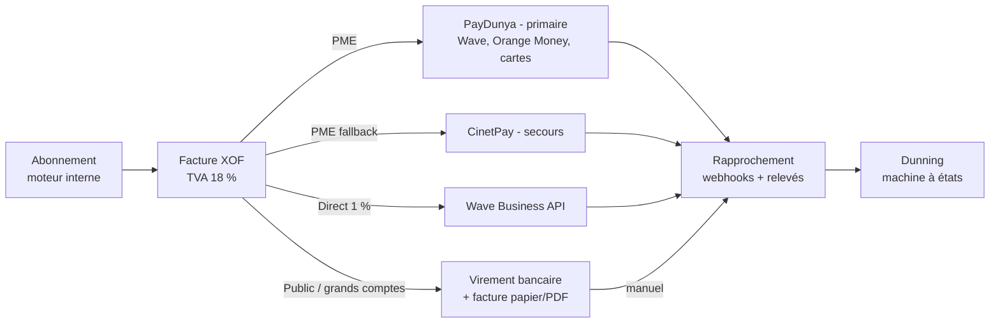

# Modèle économique et stratégie SaaS

> **Objet** : définir comment Teranga RH gagne de l'argent, encaisse, se vend et se protège — avant d'écrire la première ligne de code. Les choix ci-dessous conditionnent des décisions d'architecture (moteur de facturation, multi-tenancy, instrumentation analytics) : ils sont donc traités au même niveau d'exigence que le reste du dossier.

## 1. Pricing : par employé/mois, en XOF, trois plans

### 1.1 Ce que fait le marché

| Acteur | Modèle | Ordre de grandeur (à vérifier, tarifs mouvants) | Leçon pour nous |
|---|---|---|---|
| **Payfit** | Base fixe + prix/employé/mois | ~25-45 €/employé/mois selon modules | Le standard « per employee per month » (PEPM) est lisible et scale avec la valeur |
| **BambooHR** | Prix/employé/mois, 2 plans + add-ons | ~6-12 $/employé/mois | Plans simples, upsell par modules |
| **Deel** | À la carte (contractor ~49 $/mois, EOR ~599 $/mois) | Très supérieur, car porte le risque juridique | Le prix suit le risque porté, pas le coût technique |
| **Rippling** | Base + modules à la carte | ~8 $/user/mois + modules | La modularité extrême complexifie la vente — à éviter au début |
| **Sage Paie (Afrique francophone)** | Licence + maintenance annuelle via intégrateurs | Coût initial élevé, TCO opaque | Notre angle d'attaque : SaaS transparent contre licence on-premise opaque |

Le PEPM est le bon modèle : il aligne le prix sur la valeur perçue (la paie coûte par bulletin), il est auto-explicatif pour un DAF, et il croît mécaniquement avec le client (expansion revenue sans re-négociation).

### 1.2 Recommandation ferme : grille Teranga RH

Le pouvoir d'achat UEMOA impose un prix ~10× inférieur à Payfit. Un cabinet comptable facture la sous-traitance d'un bulletin de paie au Sénégal entre 2 500 et 7 500 XOF/mois (à vérifier localement) : notre prix doit être nettement sous ce coût de substitution tout en apportant plus (portail employé, congés, déclarations).

| | **Essentiel** | **Pro** | **Entreprise** |
|---|---|---|---|
| **Prix** | **1 500 XOF** (~2,3 €)/employé/mois | **3 000 XOF** (~4,6 €)/employé/mois | Sur devis, **à partir de 5 000 XOF**/employé/mois |
| **Plancher mensuel** | 20 000 XOF/mois | 50 000 XOF/mois | 500 000 XOF/mois |
| **Cible** | PME 10-50 employés | PME/ETI 50-300 | Public, groupes, 300+ |
| **Paie sénégalaise complète** (bulletins, IPRES RG + cadres, CSS PF/AT, IR barème + TRIMF, CFCE) | ✅ | ✅ | ✅ |
| **Déclarations sociales et fiscales** (exports/télédéclarations) | ✅ | ✅ | ✅ |
| Dossier salarié, congés & absences, portail employé mobile | ✅ | ✅ | ✅ |
| Exports comptables (SYSCOHADA) | ✅ | ✅ | ✅ |
| Onboarding/offboarding, workflows de validation | — | ✅ | ✅ |
| Notes de frais, gestion documentaire + signature | — | ✅ | ✅ |
| Organigramme, rapports avancés, API publique | — | ✅ | ✅ |
| Multi-sociétés / multi-conventions | — | ✅ | ✅ |
| SSO/SAML, SCIM, journal d'audit exportable | — | — | ✅ |
| SLA 99,9 %, support dédié, environnement de recette | — | — | ✅ |
| Accompagnement migration + reprise d'historique | Payant | Inclus partiel | Inclus |

Décisions assumées :

- **La paie complète est dans TOUS les plans.** C'est le cœur de la promesse et la barrière à l'entrée (personne ne fait bien IPRES + TRIMF + CCNI en SaaS moderne). On ne vend pas un plan « RH sans paie » au début : cela doublerait la surface produit pour un segment incertain.
- **Prix psychologiques XOF ronds** (1 500 / 3 000 / 5 000) : le marché raisonne en milliers de francs, pas en centimes. Pas de 1 490 XOF — perçu comme une singerie occidentale.
- **Plancher mensuel** : indispensable pour ne pas perdre d'argent sur une PME de 8 personnes (20 000 XOF ≈ 30 €/mois couvre le coût de service marginal).
- **Remise annuelle : -15 %** (≈ 2 mois offerts) en paiement d'avance. Critique pour la trésorerie d'un éditeur bootstrappé, et le prépaiement annuel est culturellement accepté en B2B UEMOA (logique de bon de commande).
- **Ordres de grandeur de revenus** : une PME de 30 employés en Essentiel = 45 000 XOF/mois (~69 €). Une ETI de 200 en Pro = 600 000 XOF/mois (~915 €). L'APIX (~350 employés, plan Entreprise à ~5 000 XOF) ≈ 1 750 000 XOF/mois (~2 670 €). **Seuil de viabilité 2 développeurs (~4-5 M XOF/mois de charges) : atteint avec l'APIX + ~15 PME, soit un objectif réaliste à 18 mois.**

Alternatives écartées :

- **Freemium** : écarté. La paie est un produit à forte responsabilité (une erreur de bulletin = préjudice) ; le gratuit attire des utilisateurs sans capacité de payer et génère du support à perte. On préfère un **essai 30 jours + première paie accompagnée**.
- **Prix par bulletin émis (usage pur)** : écarté. Revenu imprévisible pour nous, illisible pour le client, et pénalise les treizièmes mois.
- **Licence perpétuelle + maintenance** (modèle Sage/intégrateurs locaux) : écarté frontalement — c'est précisément le modèle que le SaaS doit ringardiser, et il tue le MRR.

## 2. Facturation technique : encaisser en XOF sans Stripe

### 2.1 Le constat : Stripe n'est PAS disponible au Sénégal

**Vérifié (août 2026)** : Stripe supporte ~46 pays et le Sénégal n'en fait pas partie ; même le réseau étendu via Paystack (rachat 2020) couvre Nigeria, Ghana, Kenya, Afrique du Sud et Côte d'Ivoire — **pas le Sénégal**. Une source indique que Paystack accepterait des marchands sénégalais depuis 2024 (**à vérifier directement auprès de Paystack** — statut instable). Monter une entité US (Delaware + Stripe Atlas) pour encaisser via Stripe est possible mais absurde à notre stade : coût, fiscalité double, et nos clients paient en XOF par mobile money ou virement, pas par carte.

### 2.2 Architecture d'encaissement recommandée

Décisions :

1. **PayDunya en agrégateur primaire** : acteur sénégalais, agrège Wave + Orange Money + Free Money + cartes dans un SDK unique, facture en XOF, frais négociables au-delà de ~10 M XOF/mois de volume. **CinetPay en fallback** (soutenu par Flutterwave) — mais l'incident de cyberattaque CinetPay de septembre 2025 (impayés vers des marchands) démontre exactement pourquoi il faut **deux rails dès que le volume dépasse ~20 M XOF/mois** : un agrégateur ouest-africain peut défaillir.
2. **Wave Business API en direct** pour les clients qui paient par Wave : ~1 % de frais contre 2-3,5 % via agrégateur. Contrainte : **pas de prélèvement récurrent natif** chez Wave ni chez les agrégateurs mobile money — le client doit ré-approuver chaque paiement. Conséquence produit : le renouvellement est **pull par relance** (lien de paiement mensuel envoyé automatiquement), pas un prélèvement silencieux. C'est un argument de plus pour pousser l'**annuel prépayé**.
3. **Virement + facture pour le public et les grands comptes** : l'APIX et toute entité publique paieront par virement Trésor/bancaire sur bon de commande. Aucun PSP dans la boucle. Le moteur de facturation doit donc gérer nativement le statut « payé hors ligne » avec rapprochement manuel.
4. **Moteur de facturation : interne et minimal.** Pas de Stripe Billing (indisponible), pas de Chargebee (~600 $/mois, hors budget), pas de déploiement Lago self-hosted au J1 (une brique d'infra de plus à opérer pour 2 devs). Un schéma `subscriptions / invoices / payments / dunning_states` en base, une génération PDF conforme, une numérotation séquentielle — c'est 2-3 semaines de dev et on contrôle tout. **Réévaluer Lago (open source, facturation à l'usage) quand on dépassera ~200 clients ou à l'ouverture multi-pays.**
5. **TVA sénégalaise 18 %** : facturation HT + TVA 18 % ligne à ligne, mentions légales locales (NINEA, RCCM), et gestion du cas **exonération/précompte des entités publiques** (le précompte de TVA sur les marchés publics existe au Sénégal — **taux et mécanique à vérifier avec l'expert-comptable**). Le moteur doit modéliser « TVA collectée ≠ TVA encaissée » dès le J1.
6. **Dunning adapté au contexte** : J+0 lien de paiement, J+7 relance email + WhatsApp, J+15 relance téléphonique (oui, humaine — c'est comme ça que ça marche à Dakar), J+30 suspension **progressive**. **Règle produit non négociable : on ne bloque JAMAIS l'accès aux bulletins déjà générés ni l'export des données** — obligations légales de l'employeur envers ses salariés ; on suspend uniquement la production de nouvelles paies.

## 3. Le cas APIX : design partner, pas propriétaire

C'est le point le plus dangereux du projet. Le fondateur travaille déjà pour l'APIX sur la plateforme investissements : sans structuration rigoureuse, Teranga RH risque d'être juridiquement absorbé dans cette relation. **Tout ce qui suit est à valider avec un avocat sénégalais spécialisé en droit OHADA et marchés publics — dépense prioritaire, budget 1-2 M XOF.**

### 3.1 Structuration recommandée

1. **Créer une société éditrice distincte** (SAS de droit OHADA — la forme existe depuis la révision de l'Acte uniforme de 2014) dont l'objet social est l'édition de logiciels. Étanchéité totale : comptabilité, contrats, dépôts de code, marques. Le nom « Teranga RH » (ou son successeur) est déposé à l'OAPI par cette société.
2. **Tout le code est écrit sous le pavillon de l'éditeur** : jamais sur du matériel, du temps contractuel ou des dépôts liés à la mission APIX existante. Si le contrat de prestation actuel avec l'APIX contient une clause de cession d'IP large (« tout développement réalisé dans le cadre de la mission »), la faire préciser/amender AVANT de commencer.
3. **Relation APIX = contrat de licence SaaS + convention de design partner**, deux documents séparés :
   - La **licence** : abonnement plan Entreprise, prix public avec **remise fondateur de 40-50 % pendant 24-36 mois**, puis retour progressif au tarif. Un prix nul est un piège : un client qui ne paie pas n'est pas une référence commerciale crédible et ne teste pas le circuit de facturation publique.
   - La **convention design partner** : l'APIX apporte des retours structurés, l'accès à ses cas de paie réels, son logo en référence ; en échange de la remise et d'un canal de support privilégié. **Elle ne confère ni exclusivité, ni droit sur la feuille de route, ni IP.**
4. **Clause de propriété intellectuelle — non négociable** : l'éditeur conserve 100 % du code, du produit et des évolutions, y compris celles suggérées ou financées par l'APIX. L'APIX obtient un droit d'usage. Toute demande spécifique APIX est soit intégrée au produit (financée par l'abonnement), soit refusée — **pas de fork « version APIX »**. Si l'APIX exige une cession ou une copropriété : refuser, quitte à perdre le client fondateur. Un produit dont le code appartient partiellement à une agence publique sénégalaise est invendable à l'international et infinançable.

### 3.2 Pièges du client public — et parades

| Piège | Réalité | Parade |
|---|---|---|
| **Marchés publics** | Au-delà des seuils (Code des marchés publics, régulation ARCOP — seuils exacts **à vérifier**), l'APIX doit passer un appel d'offres ; un gré à gré mal ficelé est annulable | Démarrer sous le seuil de dispense (abonnement annuel calibré en conséquence), viser ensuite une procédure propre ; ne jamais accepter un montage « caché » dans un autre marché |
| **Délais de paiement** | 60 à 120 jours après service fait, parfois plus | Facturation annuelle d'avance négociée, trésorerie dimensionnée pour 90 jours de DSO, pénalités de retard contractuelles (même si rarement appliquées, elles cadrent la négociation) |
| **Conflit d'intérêts** | Le fondateur est déjà prestataire APIX sur un autre projet | Transparence écrite vis-à-vis de l'APIX, contrats et facturations strictement séparés, pas de temps croisé |
| **Capture produit** | Le client fondateur pousse ses spécificités (statut public, primes particulières) dans le cœur du produit | Gouvernance produit : toute spécificité passe par le système de configuration (conventions, rubriques de paie paramétrables) prévu au chapitre architecture paie — jamais en dur |

## 4. Go-to-market : Sénégal d'abord, UEMOA ensuite

### 4.1 Séquence

1. **Phase 1 (mois 0-12)** — APIX en production + 8-10 PME dakaroises « amies » (réseau direct, prix de lancement). Objectif : prouver la paie juste, 12 cycles de paie sans incident.
2. **Phase 2 (mois 12-24)** — Sénégal en volume via prescripteurs. Objectif : 40-60 clients, MRR ~8-12 M XOF.
3. **Phase 3 (mois 24+)** — Côte d'Ivoire en premier (plus gros marché UEMOA, CNPS/ITS à modéliser, agrégateurs identiques), puis Bénin/Togo/Burkina. L'architecture multi-pays du moteur de paie (chapitre dédié) est le prérequis technique.

### 4.2 Canaux, par ordre de priorité

1. **Experts-comptables et cabinets comptables — LE canal.** Ils tiennent la paie de dizaines de PME chacun et souffrent avec Excel/Sage. Offre dédiée : **compte cabinet multi-dossiers** (un espace, N sociétés clientes), remise partenaire de 20-25 %, voire co-branding des bulletins. Cibler l'**ONECCA** (Ordre National des Experts Comptables et Comptables Agréés du Sénégal) : ateliers, présence aux événements de l'Ordre. Un cabinet convaincu = 10-30 PME en pipeline. C'est aussi la parade au cycle de vente long : le cabinet a déjà la confiance du client.
2. **Référence publique APIX** : au Sénégal, « l'APIX nous fait confiance » ouvre les portes des ETI et des autres agences publiques (avec l'accord écrit de l'APIX sur l'usage du logo — à inclure dans la convention design partner).
3. **Cabinets RH et de portage** (recrutement, intérim, externalisation paie à Dakar) : partenariats d'apport d'affaires, commission 10-15 % première année.
4. **Bouche-à-oreille Dakar + communauté tech** (DER/FJ, CTIC Dakar, événements GES/Dakar Digital) : crédibilité, recrutement, early adopters tech.
5. **Écarté pour l'instant** : publicité payante (CAC injustifiable sur un marché où tout passe par la confiance), et vente outbound à froid (inefficace culturellement sans introduction).

## 5. Métriques SaaS instrumentées dès le J1

L'instrumentation est une exigence d'architecture (événements produits + schéma de facturation propre), pas un projet ultérieur.

| Métrique | Définition retenue | Cible 18 mois | Source |
|---|---|---|---|
| **MRR** (+ décomposition new/expansion/churn) | Somme des abonnements actifs normalisés au mois | 5-8 M XOF | Moteur de facturation interne |
| **Churn logo mensuel** | Clients perdus / clients actifs | < 1,5 %/mois | Facturation |
| **NRR** | Revenu cohorte N vs N-12, expansions incluses | > 105 % (croissance des effectifs clients = expansion mécanique du PEPM) | Facturation |
| **CAC par canal** | Coûts commerciaux / clients signés, par canal | < 6 mois de MRR du client | CRM + compta |
| **Activation** | **Première paie réelle clôturée < 30 jours après signature** | > 80 % des signatures | Événements produit |
| **Time-to-first-payroll** | Délai signature → première paie | < 15 jours | Événements produit |
| **DSO public** | Délai facture → encaissement, segment public | Suivi (pas de cible, mais alerte trésorerie) | Facturation |

**Outillage minimal, sans over-engineering** : PostHog (cloud, gratuit jusqu'à 1 M événements/mois) pour les événements produit ; Metabase (self-hosted, gratuit) branché en lecture sur la base de facturation pour MRR/churn/NRR ; un CRM léger (HubSpot Free ou Attio) pour le pipeline et le CAC. **Écarté** : ChartMogul/Baremetrics (conçus pour Stripe, inutilisables sur notre rail XOF), stack data dédiée (dbt/warehouse) avant 200 clients.

## 6. Risques business majeurs et parades

| Risque | Prob. | Impact | Parade |
|---|---|---|---|
| **Dépendance APIX** (mono-client, mono-référence) | Élevée au départ | Fatal si l'APIX se retire avant la traction | Plafond explicite : APIX < 30 % du MRR à 18 mois ; les 8-10 PME de la phase 1 sont non négociables ; contrat APIX pluriannuel avec préavis long |
| **Concurrence locale** : Socium (SIRH panafricain, Dakar), SmartTeam/WEBGRAM (Dakar), Kayfay/SoftValley Labs (Dakar, SaaS ou on-premise), Sage + intégrateurs, Odoo localisé ; Payfit/Rippling ne viendront pas sur l'UEMOA à moyen terme | Certaine | Moyen | Différenciation frontale : profondeur du moteur de paie sénégalais (IPRES/CSS/TRIMF/CFCE juste et à jour, testé publiquement), UX niveau Stripe/Linear, mobile-first employé, offline-tolerant — le chapitre produit en fait des invariants |
| **Cycle de vente B2B public long** (6-18 mois) | Certaine | Trésorerie | Le public est une vitrine, pas le fonds de commerce : le volume vient des PME via experts-comptables (cycle 1-3 mois) |
| **Défaillance d'un agrégateur de paiement** (précédent CinetPay 2025) | Moyenne | Trésorerie bloquée | Double rail PayDunya + CinetPay/Wave, virement toujours possible, pas plus de 50 % du volume sur un seul PSP |
| **Changement réglementaire paie** (barème IR, taux IPRES/CSS) | Certaine (récurrente) | Confiance produit | Veille structurée (abonnement à un cabinet fiscal local), moteur de paie versionné par période légale (choix d'architecture au chapitre paie) — en faire un argument commercial (« conforme en 48 h ») |
| **Impayés PME** | Élevée | MRR fictif | Prépaiement annuel incité (-15 %), suspension progressive à J+30, pas de service à crédit au-delà de 60 jours |
| **Capture juridique par le client fondateur** | Moyenne | Fatal pour la commercialisation | Section 3 : société distincte, IP verrouillée, avocat dès maintenant |

**Position tranchée finale** : le modèle est un SaaS PEPM en XOF, vendu par la confiance (experts-comptables + référence APIX), encaissé par des rails locaux redondants, porté par une société éditrice indépendante dont l'IP est sanctuarisée. Chaque décision d'architecture des chapitres suivants (multi-tenancy, moteur de paie configurable, instrumentation événementielle, facturation interne) découle directement de ces choix économiques.

---

### Sources consultées (points vérifiés en ligne, août 2026)

- Disponibilité Stripe : [Stripe global availability](https://stripe.com/global), [Stripe Supported Countries 2026 (Dodo Payments)](https://dodopayments.com/blogs/stripe-supported-countries-alternatives), [Does Stripe Work in Africa?](https://ngwaspenn.com/stripe-supported-countries-africa/)
- Agrégateurs Sénégal/UEMOA : [Stripe Sénégal : 5 alternatives crédibles (Kolonell)](https://kolonell.com/fr/blog/stripe-senegal-alternatives-passerelles-locales-2026), [PayDunya vs IntouchPay vs CinetPay (Kolonell)](https://kolonell.com/en/blog/paydunya-intouch-cinetpay-compared-2026), [Incident CinetPay 2025 (SocialNetLink)](https://www.socialnetlink.org/2026/02/06/d-pay-speaks-out-flutterwave-backed-cinetpay-owes-over-1-million-to-partners-following-cyberattack/)
- Wave Business API : [Guide intégration Wave Business API (Kolonell)](https://kolonell.com/fr/blog/wave-business-api-integration-site-2026), [API Wave Sénégal (Sene-Pay)](https://www.sene-pay.com/api-wave-senegal)
- Concurrents SIRH locaux : [Socium](https://socium.link/gestion-rh-afrique/), [SmartTeam / WEBGRAM](https://www.agencewebgram.com/2026/03/Digitalisation-RH-Top-5-des-logiciels-SaaS-adaptes-au-marche-africain.html), [Kayfay / SoftValley Labs](https://softvalleylabs.com/)

*Les tarifs concurrents (Payfit, BambooHR, Deel, Rippling), les seuils de marchés publics sénégalais, le mécanisme de précompte de TVA et le statut Paystack-Sénégal sont marqués « à vérifier » dans le corps du chapitre et doivent être confirmés avant toute décision contractuelle.*
