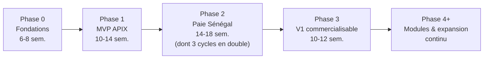
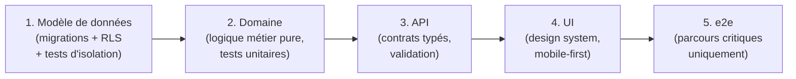

# Roadmap de construction et plan d'exécution

> **⚠️ Arbitrages post-revue** ([09-revue-critique.md](09-revue-critique.md), A1/A2) : (1) « Paie exclue du MVP » se lit désormais « **paie = Lot 2 du pilote APIX** », contractualisé dès la signature (cf. ch. 01) — la Phase 2 reste une phase dédiée, mais elle fait partie de l'engagement pilote. (2) Les durées de ce chapitre supposent un fondateur à temps quasi plein : à ~50-60 % de capacité, l'horizon V1 réaliste est de **20-24 mois** ; les 12-15 mois annoncés n'existent que si le dev n°2 rejoint dès la Phase 1 **et** que la capacité fondateur remonte à ≥ 80 % pour la Phase 2 (paie). Le lancement de la Phase 2 est conditionné à ces prérequis + plan de financement. (3) Deux chantiers bloquants s'ajoutent à la roadmap : **reprise de données** (module à part entière, rodé sur les données APIX) et **conduite du changement / déploiement APIX** (sponsor exécutif, relais métier, hypercare 2 cycles, adoption progressive).

Ce chapitre transforme l'architecture cible en plan d'exécution pour une réalité précise : **un développeur très productif, assisté par IA, disponible à ~50-60 % de son temps** (le reste étant consacré à la plateforme APIX investissements). Toutes les durées ci-dessous sont des **durées calendaires** intégrant cette capacité partielle. Elles supposent que les choix des chapitres précédents (stack, modèle multi-tenant, moteur de paie) sont actés et ne sont pas rediscutés en cours de route.

## 1. Principes de séquencement

Quatre règles gouvernent tout le plan :

1. **L'irréversible d'abord, le reste jamais en avance.** La Phase 0 contient uniquement ce qui coûte 10x à 100x plus cher à changer après coup (multi-tenancy, effective dating, audit). Tout ce qui peut être ajouté plus tard sans migration douloureuse est explicitement repoussé.
2. **De la valeur livrée à chaque phase.** Chaque phase se termine par un livrable utilisé par de vrais utilisateurs, pas par un jalon technique interne. L'APIX utilise le produit dès la fin de la Phase 1.
3. **Le risque paie est isolé.** La paie est le seul module où une erreur détruit la confiance de façon irrécupérable. Elle a sa propre phase, son propre protocole de validation, et ne bloque jamais le reste.
4. **Un seul epic en cours (WIP = 1).** Avec un dev sur deux projets, le multitâche intra-projet est le premier tueur de vélocité. Chaque semaine a un objectif unique et vérifiable.

Horizon global : **V1 commercialisable 12 à 15 mois après le premier commit.** C'est long en absolu, mais court pour un SaaS RH avec paie — Payfit a mis ~2 ans avec une équipe complète avant d'ouvrir son deuxième pays.

## 2. Phase 0 — Fondations (6-8 semaines)

Objectif de sortie : un squelette applicatif déployé en production (vide de features mais complet en garanties), sur lequel chaque feature ultérieure s'écrit **sans jamais retoucher les fondations**.

### Ce qui DOIT être dans la Phase 0 (quasi impossible à changer après)

| Élément | Pourquoi irréversible | Effort |
|---|---|---|
| Monorepo + tooling (workspaces, lint, typecheck, conventions) | Restructurer un dépôt vivant casse l'historique et les habitudes | 2-3 j |
| Multi-tenancy : `tenant_id` sur toutes les tables + **RLS PostgreSQL activée dès la table n°1** + tests automatisés d'isolation | Le retrofit de RLS sur un schéma existant est le chantier le plus dangereux qui existe en SaaS B2B | 4-6 j |
| Auth (sessions, MFA-ready, modèle compatible SSO futur) | Le modèle identité/compte/membership se propage partout | 3-5 j |
| RBAC : rôles, permissions, scopes (org / département / self) | Chaque endpoint et chaque écran en dépend dès le premier | 3-4 j |
| Audit log append-only (qui, quoi, quand, avant/après) branché au niveau de la couche d'accès aux données | Impossible à reconstituer rétroactivement ; exigé par la loi 2008-12 et le RGPD | 2-3 j |
| **Effective dating** sur les entités cœur (employé, poste, rémunération) : tables de versions avec `valid_from`/`valid_to` | Le passage d'un modèle « état courant » à un modèle temporel est une réécriture, pas une migration | 4-5 j |
| i18n branchée (fr par défaut, zéro chaîne en dur dès le premier écran) | Extraire les chaînes après coup = des semaines de travail ingrat | 1-2 j |
| Design system minimal : tokens (couleurs, espacements, typo), 15-20 primitives (bouton, champ, table, modal, toast) sur base Radix/shadcn ou équivalent acté au chapitre frontend | La cohérence visuelle niveau Stripe/Linear ne se rattrape pas écran par écran | 5-7 j |
| CI/CD : tests + migrations réversibles + déploiement continu, environnements preview/staging/prod | La discipline de livraison se crée au jour 1 ou jamais | 2-3 j |
| Backups automatisés + PITR testés par une restauration réelle | Non négociable pour des données RH | 1 j |

Total : ~28-39 jours-homme, soit 6-8 semaines calendaires à mi-temps. **Coût infra à ce stade : < 100 €/mois** (Postgres managé, hébergement, CI).

### Ce qui peut attendre (et attendra)

- SSO SAML/OIDC entreprise (le modèle de données le prévoit ; l'implémentation vient avec le premier client qui l'exige, Phase 3+).
- Billing/facturation (Phase 3), API publique et webhooks (Phase 3+), notifications push mobiles (Phase 2+).
- Interface complète de champs custom (la colonne JSONB + le registry existent dès la Phase 0 ; l'UI d'administration vient en Phase 3).
- Wolof, SOC 2, data warehouse analytique, mode hors-ligne avancé.

Critère de passage en Phase 1 : les tests d'isolation inter-tenant passent en CI, une restauration de backup a été exécutée avec succès, un écran de démonstration complet (auth → liste → détail → édition auditée) tourne en production.

## 3. Phase 1 — MVP APIX (10-14 semaines)

### Périmètre — tranché

**Inclus :** Core HR (dossier employé effective-dated, contrats, organigramme, documents), congés et absences (types selon la convention collective nationale interprofessionnelle, workflow de validation à 1-2 niveaux, calcul des soldes), portail employé **mobile-first (PWA)** : consultation du dossier, demande de congé, validation manager. Import CSV des données existantes de l'APIX. **Export « variables de paie »** (absences, entrées/sorties) vers le processus de paie actuel de l'APIX.

**Exclu — et c'est la décision la plus importante du chapitre : la paie n'est PAS dans le MVP.** Trois raisons :

1. **Asymétrie du risque.** Un bug dans les congés se corrige avec des excuses ; un bug sur un bulletin de salaire détruit la confiance du client pilote et la réputation du produit avant même sa naissance. La paie exige un protocole de validation (voir Phase 2) incompatible avec le rythme d'un MVP.
2. **Dépendance aux données.** Un moteur de paie ne vaut que par la qualité des données Core HR qui l'alimentent (salaires de base, situations familiales pour le TRIMF, dates effectives). Le MVP sert précisément à fiabiliser ces données pendant 2-3 mois avant d'y brancher la paie.
3. **Time-to-market.** Le couple Core HR + congés se livre en ~3 mois et rend l'APIX utilisatrice quotidienne. La paie ajouterait 4+ mois pendant lesquels personne n'utilise rien.

L'export « variables de paie » est le pont : l'APIX garde son processus de paie actuel, mais alimenté par Teranga RH — ce qui prépare mécaniquement la Phase 2.

### Critères de succès mesurables (fin de Phase 1)

- 100 % des employés APIX présents dans le système avec dossier complet.
- ≥ 80 % des demandes de congés passent par l'outil sur un mois glissant.
- Délai médian de validation d'une demande < 48 h.
- ≥ 60 % des employés se connectent au portail au moins une fois par mois.
- Zéro incident de sécurité, zéro accès inter-tenant (vérifié par les tests d'isolation en continu).
- p95 des écrans principaux < 500 ms depuis Dakar sur connexion mobile 4G.

## 4. Phase 2 — Paie Sénégal (14-18 semaines, dont 3 cycles de paie en double)

### Pourquoi une phase dédiée

Le moteur de paie sénégalaise (IPRES régime général et régime cadres, CSS prestations familiales et accidents du travail, IR à barème progressif, TRIMF, CFCE employeur, règles de la CCNI) est **l'actif stratégique du produit** — c'est lui qui crée la barrière à l'entrée face aux acteurs internationaux qui ne couvrent pas le Sénégal. Il mérite le traitement d'un projet à part entière : périmètre gelé, protocole de validation formel, aucune autre feature en parallèle.

Règle d'implémentation : **chaque taux et chaque plafond est codé avec sa source, sa date de validité et sa période d'application** (le moteur est versionné par période légale — un recalcul de janvier en juillet doit utiliser les règles de janvier). Tout taux non confirmé par un texte officiel ou par l'expert-comptable partenaire est marqué **« à vérifier »** dans le code et bloque la mise en production. Ce chapitre ne fige volontairement aucun taux : c'est le rôle du chapitre « moteur de paie » et de la validation terrain.

### Stratégie de validation : paie en double (shadow payroll)

1. **Construction du moteur** (6-8 sem.) : fonction pure et déterministe `(dossier employé, variables du mois, règles versionnées) → bulletin`, sans I/O, testable exhaustivement.
2. **Golden files** (en continu) : 30-50 bulletins réels APIX anonymisés deviennent des tests de non-régression ; chaque cas particulier découvert (entrée/sortie en cours de mois, cadre vs non-cadre, avantages en nature) ajoute un golden file.
3. **Paie en double, 3 cycles** (3 mois calendaires, ~2-3 jours d'effort par cycle) : Teranga RH calcule la paie complète en parallèle du processus existant de l'APIX. Rapprochement **au centime près**, chaque écart classé : bug (corrigé + golden file), erreur de l'existant (documentée, arbitrée), ou différence d'interprétation réglementaire (tranchée avec l'expert-comptable).
4. **Critère de bascule — tolérance zéro** : deux cycles consécutifs à 100 % de concordance ou avec écarts intégralement expliqués et arbitrés par écrit. Pas de bascule partielle, pas de « c'est presque bon ».
5. **Après bascule** : génération des états déclaratifs (IPRES, CSS, IR) et export virements ; l'intégration mobile money (Wave, Orange Money) pour les catégories de personnel concernées est un lot optionnel de fin de phase.

Le calendrier de cette phase se cale sur les cycles mensuels de paie : commencer la construction du moteur pendant que la Phase 1 se stabilise permet de ne pas perdre un mois.

## 5. Phases suivantes

### Phase 3 — V1 commercialisable multi-tenant self-service (10-12 semaines)

Objectif : un deuxième puis un troisième client s'onboardent **sans intervention manuelle sur la base de données**. Contenu : onboarding tenant self-service (création d'organisation, import guidé, paramétrage congés/paie), billing (Stripe pour l'international, à compléter d'un moyen de paiement local — virement/mobile money — pour la zone UEMOA), plans tarifaires, UI d'administration des champs custom et des workflows, durcissement sécurité (rate limiting, politique de mots de passe, journalisation renforcée), documentation utilisateur, site vitrine. Cible commerciale : PME/ETI sénégalaises de 20 à 300 employés — le moteur de paie Sénégal validé chez l'APIX est l'argument de vente n°1.

### Phase 4+ — Modules complémentaires et expansion (continu)

- **Ordre des modules, dicté par la demande solvable UEMOA** : recrutement léger (ATS simple) → entretiens/performance → formation. Chaque module est un lot de 6-10 semaines, jamais deux en parallèle.
- **Expansion pays : Côte d'Ivoire d'abord** (plus grand marché UEMOA, même zone monétaire, droit du travail proche mais régime fiscal et social distinct — ITS, CNPS). Condition d'entrée : ≥ 3 clients payants hors APIX au Sénégal et un moteur de paie déjà structuré en « packs de règles pays » versionnés. Un nouveau pays = un nouveau pack + un partenaire expert-comptable local, pas une réécriture.

## 6. Ordre de construction technique et discipline de qualité

Dans **chaque** phase et chaque module, l'ordre est invariant :

Commencer par le modèle de données force à résoudre les questions difficiles (temporalité, unicité, isolation) quand elles coûtent le moins cher. L'UI en dernier évite de figer des écrans sur un modèle instable.

**Pyramide de tests, proportionnée à l'enjeu :**

| Couche | Stratégie | Volume |
|---|---|---|
| Moteur de paie | Golden files de bulletins réels + **property-based** (ex. : l'IR est croissant avec le brut à situation égale ; somme des retenues + net = brut ; un changement effectif en cours de mois prorate correctement) | Exhaustif — c'est ici que se joue le produit |
| Domaine (congés, soldes, effective dating) | Tests unitaires sur la logique pure | Élevé |
| Isolation multi-tenant | Suite dédiée exécutée à chaque CI (tentatives d'accès croisé sur chaque table) | Systématique |
| API | Tests d'intégration sur les endpoints à logique non triviale | Ciblé |
| e2e | **6 parcours seulement** : login, demande + validation de congé, consultation portail employé, cycle de paie complet, onboarding d'un employé, export déclaratif | Minimal et stable |

Interdiction explicite de viser un pourcentage de couverture global : la couverture se concentre là où l'erreur coûte cher. Chaque décision structurante est consignée en **ADR** (architecture decision record) de 15 lignes — c'est la mémoire du projet et l'assurance bus factor.

## 7. Risques d'exécution majeurs et parades

| Risque | Probabilité | Impact | Parade |
|---|---|---|---|
| Burn-out du solo dev sur 2 projets | Élevée | Fatal | WIP = 1 epic ; blocs de 2-3 jours consécutifs par projet (jamais d'alternance intra-journée) ; une semaine « off produit » toutes les 8 semaines ; renoncer par écrit à ce qui est repoussé |
| Bus factor = 1 | Certaine au départ | Fatal si durable | ADR + runbooks dès la semaine 1 ; infra 100 % as-code ; **recrutement du dev n°2 déclenché avant le début de la Phase 2** (la paie ne doit pas reposer sur une seule tête) |
| Sur-engineering des fondations | Élevée (profil ambitieux) | Retard de 3-6 mois | Interdits explicites : pas de microservices, pas de Kafka, pas de Kubernetes, pas de multi-région — **monolithe modulaire jusqu'à ~50 tenants** ; toute exception exige un ADR justifié par un problème constaté, pas anticipé |
| Sous-investissement sur multi-tenancy / effective dating | Moyenne | Dette irrécupérable | Ces deux sujets sont Phase 0, non négociables, avec tests en CI ; c'est la seule « avance » technique autorisée |
| Scope creep APIX | Certaine | Produit non générique | Voir dispositif ci-dessous |
| Dérive réglementaire (taux, barèmes qui changent) | Certaine (annuelle) | Erreurs de paie | Moteur versionné par période légale ; veille formalisée avec l'expert-comptable partenaire ; chaque changement = nouveau pack de règles + golden files |
| L'APIX comme unique client trop longtemps | Moyenne | Produit sur-adapté au secteur public | Prospection de 2-3 PME pilotes dès la Phase 2 ; la Phase 3 a un critère de sortie commercial, pas seulement technique |

### Dispositif anti-scope-creep APIX

L'APIX demandera des spécificités (workflows d'approbation administratifs, champs propres au statut public, états particuliers). La règle : **on dit oui au besoin, jamais au code spécifique.** Trois mécanismes, tous prévus dès la Phase 0 dans le modèle de données :

1. **Champs custom** : colonne JSONB + registry typé par tenant (libellé, type, validation, visibilité). L'UI d'administration arrive en Phase 3, mais l'APIX en bénéficie dès la Phase 1 via paramétrage assisté.
2. **Workflows configurables** : les circuits de validation (congés, puis autres) sont des données (étapes, rôles approbateurs, conditions), pas du code. Une demande de circuit à 3 niveaux = une configuration, pas une feature.
3. **Feature flags par tenant** : tout module ou comportement optionnel est activable par tenant.

Test de gouvernance pour chaque demande APIX : « une PME ivoirienne pourrait-elle vouloir la même chose ? » Si oui → produit générique (éventuellement derrière un flag). Si non → configuration via les trois mécanismes. **La ligne `if (tenant === 'APIX')` est interdite dans le code, sans exception.** Si aucun des trois mécanismes ne couvre la demande, elle est refusée ou repoussée — et ce refus est un service rendu au produit.

## 8. Tableau récapitulatif

| Phase | Durée (calendaire, mi-temps) | Livrables clés | Critère de passage à la suivante |
|---|---|---|---|
| **0 — Fondations** | 6-8 semaines | Squelette en prod : monorepo, auth, RLS + tests d'isolation, RBAC, audit log, effective dating, i18n, design system minimal, CI/CD, backups testés | Tests d'isolation verts en CI ; restauration de backup réussie ; écran de démo complet en production |
| **1 — MVP APIX** | 10-14 semaines | Core HR + congés/absences + portail employé PWA ; import CSV ; export variables de paie | Critères d'adoption atteints (§3) ; données APIX complètes et fiables ; engagement APIX pour le pilote paie |
| **2 — Paie Sénégal** | 14-18 semaines | Moteur de paie versionné, bulletins conformes, golden files, états déclaratifs, export virements | 2 cycles consécutifs de paie en double à 100 % de concordance (ou écarts arbitrés par écrit) ; bascule APIX effectuée |
| **3 — V1 commercialisable** | 10-12 semaines | Onboarding self-service, billing, UI champs custom + workflows, durcissement sécurité, documentation, site | 1er client payant hors APIX onboardé sans intervention manuelle |
| **4+ — Modules & expansion** | Lots de 6-10 semaines | ATS léger, performance, formation ; pack paie Côte d'Ivoire | Par lot : adoption mesurée ; pour l'expansion : ≥ 3 clients payants au Sénégal |

Cumul jusqu'à la V1 : **~40-52 semaines de travail effectif, soit 12-15 mois calendaires.** Coût infra total sur la période : < 3 000 €. Le poste de coût réel est le temps du fondateur et l'expert-comptable partenaire (prévoir un budget de validation paie, ordre de grandeur 2 000-4 000 € sur la Phase 2).

## 9. Les 10 décisions de la semaine 1 (checklist actionnable)

1. **Obtenir l'engagement écrit de l'APIX comme client pilote** : sponsor nommé, accès aux données, participation à la paie en double en Phase 2. Sans cela, tout le plan change.
2. **Geler le périmètre du MVP sans paie** (ADR-001) et le faire contresigner par le sponsor APIX — c'est le rempart contre le premier scope creep.
3. **Geler la stack** issue des chapitres précédents (ADR-002) : plus aucun débat d'outillage après la semaine 1.
4. **Acter le modèle multi-tenant** : pool partagé + RLS PostgreSQL, `tenant_id` obligatoire sur toute table (ADR-003).
5. **Acter la stratégie d'effective dating** (tables de versions `valid_from`/`valid_to` sur employé, poste, rémunération) et son ergonomie de saisie (ADR-004).
6. **Choisir le fournisseur d'auth** (build minimal vs service managé) avec exigence : compatible SSO futur, MFA, hébergement des données conforme loi 2008-12 / RGPD (ADR-005).
7. **Bootstraper le monorepo et la CI/CD** : premier déploiement en production (page vide) avant la fin de la semaine.
8. **Fixer les conventions i18n** (langue des clés, format des fichiers, processus de traduction) — une heure de décision, des mois d'économies.
9. **Lancer la conformité données personnelles** : registre des traitements, identification des formalités auprès de la CDP (démarche exacte « à vérifier » avec un conseil local), politique de rétention.
10. **Écrire la definition of done et le rituel qualité** : tests exigés par couche (§6), revue systématique (auto-revue outillée par IA tant que l'équipe est de 1), cadence de release hebdomadaire, journal ADR ouvert.

Ces dix décisions tiennent en une semaine parce qu'elles ne créent rien : elles **ferment des débats**. C'est exactement ce dont un solo dev ambitieux a besoin pour que les 14 mois suivants soient de l'exécution, pas de la re-délibération.
